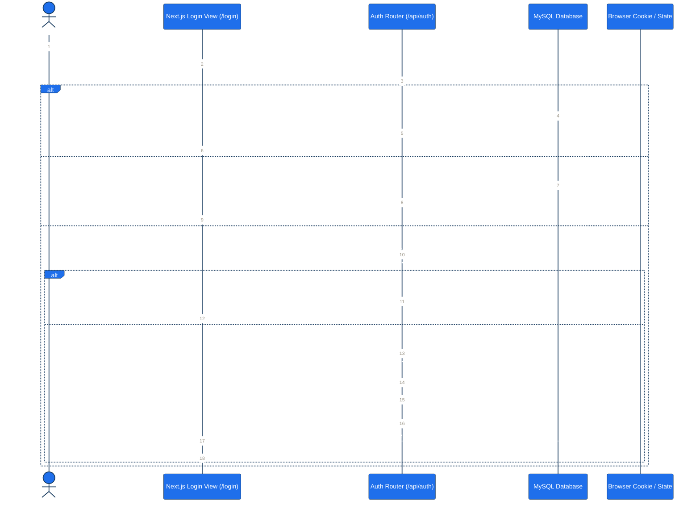
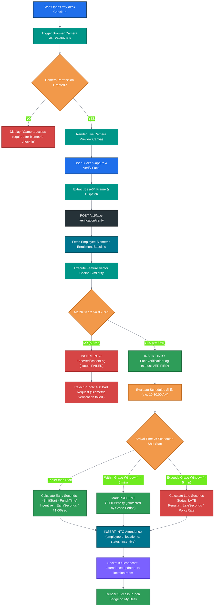
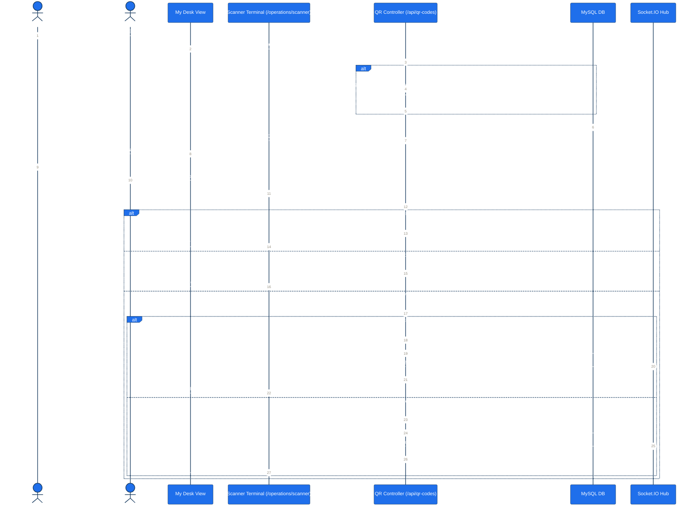
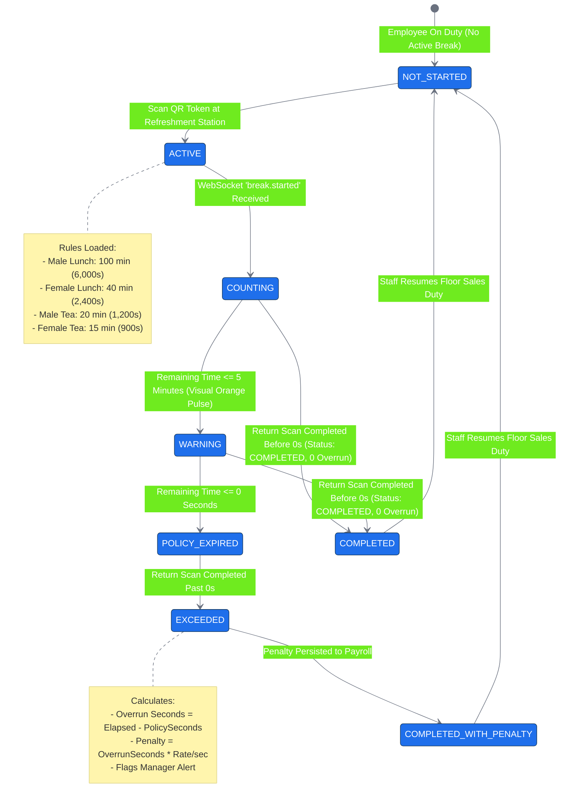
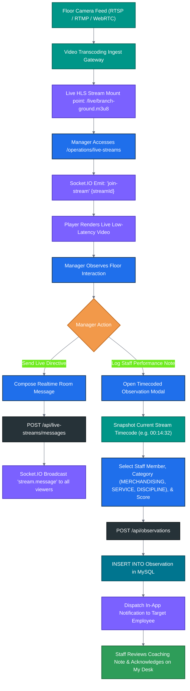
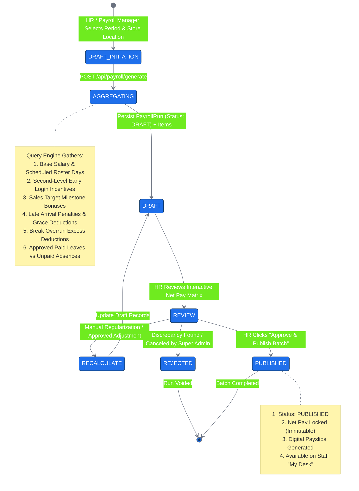

# BSC Textiles HRMS — Master Application Flow Specification

```text
BSC Textiles Pvt Ltd
Weaving Dreams, Building Futures
Document: Master Application & Journey Flows (appflow.md)
Version: 1.0.0 (Production Architecture)
```

---

## 1. Executive Summary & Flow Topology 

The **BSC Textiles HRMS** application orchestrates complex, real-time retail workforce interactions across 4 store locations (`Belagavi`, `Davanagere`, `Shivamogga`, `Hubballi`), 14 functional user roles, and 32+ responsive application views.

This document defines the complete end-to-end navigational, state machine, and transactional flows governing the system.

### Global Flow Color Standard

All Mermaid diagrams in this document adhere to the BSC Textiles HRMS semantic color design system:
- **Navy (`#173A5E`) / Dark (`#263238`):** Security, auth gates, infrastructure, session persistence.
- **Blue (`#1F6FEB`):** User interfaces, frontend views, client triggers, API endpoints.
- **Green (`#2E9D59`):** Successful validation, on-time status, completed workflows, authorized state.
- **Orange (`#F2994A`):** Calculations, warning states, grace periods, policy evaluation rules.
- **Red (`#D64545`):** Rejections, 401/403 errors, failed biometrics, break overruns, penalty accruals.
- **Purple (`#7B61FF`):** Real-time WebSocket dispatches, push alerts, live streams, chat messages.
- **Teal (`#009688`):** Biometric devices, camera capture, QR scanner hardware, external inputs.
- **Database Blue (`#00758F`):** ACID database transactions, Prisma queries, MySQL tables.

---

## 2. High-Level System Navigation & Route Map

```mermaid
%%{init: {'theme': 'base', 'themeVariables': { 'primaryColor': '#1F6FEB', 'primaryTextColor': '#FFFFFF', 'primaryBorderColor': '#173A5E', 'lineColor': '#6B7280' }}}%%
flowchart TD
    ROOT["/ (Landing / Root Gateway)"]:::cDark --> AUTH_CHECK{"Authenticated Session Active?"}:::cOrange

    AUTH_CHECK -- "NO" --> LOGIN["/login (Authentication Portal)"]:::cBlue
    AUTH_CHECK -- "YES" --> ROLE_DISPATCH{"Evaluate Role Privilege"}:::cOrange

    LOGIN --> CRED_VAL["POST /api/auth/login"]:::cDark
    CRED_VAL -- "Valid Auth" --> ROLE_DISPATCH
    CRED_VAL -- "Invalid Auth" --> LOGIN_ERR["Display Error Toast"]:::cRed

    ROLE_DISPATCH -- "SUPER_ADMIN / ADMIN" --> DASH_EXEC["/dashboard (Executive Roster & KPI Overview)"]:::cBlue
    ROLE_DISPATCH -- "HR_MANAGER / HR_EXECUTIVE" --> DASH_HR["/attendance/muster (HR Operations Central)"]:::cBlue
    ROLE_DISPATCH -- "FLOOR / DEPT MANAGER" --> DASH_FLOOR["/operations/observations (Live Floor Monitor)"]:::cBlue
    ROLE_DISPATCH -- "T_SHOP_OWNER / SCANNER" --> SCAN_TERM["/operations/scanner (QR Scanner Terminal)"]:::cBlue
    ROLE_DISPATCH -- "SALES_EMPLOYEE / GENERAL" --> MY_DESK["/my-desk (Self-Service Attendance & QR Badge)"]:::cBlue

    subgraph ADMIN_ROUTES["Administrative Management Space"]
        DASH_EXEC --> ADM_USERS["/admin/users"]:::cBlue
        DASH_EXEC --> ADM_ROLES["/admin/roles"]:::cBlue
        DASH_EXEC --> ADM_AUDIT["/admin/audit"]:::cBlue
        DASH_EXEC --> ADM_BACKUP["/admin/backup"]:::cBlue
        DASH_EXEC --> ADM_SETTINGS["/admin/settings"]:::cBlue
    end

    subgraph ORG_ROUTES["Organizational Topology Space"]
        DASH_EXEC --> ORG_LOC["/organization/locations"]:::cBlue
        DASH_EXEC --> ORG_FLOORS["/organization/floors"]:::cBlue
        DASH_EXEC --> ORG_DEPTS["/organization/departments"]:::cBlue
        DASH_EXEC --> ORG_SECT["/organization/sections"]:::cBlue
        DASH_EXEC --> ORG_SP["/organization/selling-points"]:::cBlue
    end

    subgraph HR_OPS_ROUTES["Workforce & HR Operations Space"]
        DASH_HR --> HR_EMP["/employees (Directory & Profile Master)"]:::cBlue
        DASH_HR --> HR_ATT["/attendance (Daily Check-in Log)"]:::cBlue
        DASH_HR --> HR_SHIFTS["/attendance/shifts (Shift Windows)"]:::cBlue
        DASH_HR --> HR_LEAVES["/leaves (Applications & Approvals)"]:::cBlue
        DASH_HR --> HR_INC["/incentives (Formula Rules & Grants)"]:::cBlue
        DASH_HR --> HR_PAY["/payroll (Draft Runs & Payslips)"]:::cBlue
        DASH_HR --> HR_REP["/reports (Muster Roll & Exports)"]:::cBlue
    end

    subgraph FLOOR_OPS_ROUTES["Live Operations Space"]
        DASH_FLOOR --> OP_STREAMS["/operations/live-streams (Showroom Camera Feeds)"]:::cPurple
        DASH_FLOOR --> OP_NOTES["/operations/observations (Staff Timecoded Notes)"]:::cPurple
        DASH_FLOOR --> OP_BREAKS["/attendance/breaks (Live Break Counters)"]:::cGreen
    end

    classDef cBlue fill:#1F6FEB,stroke:#173A5E,stroke-width:2px,color:#FFFFFF;
    classDef cGreen fill:#2E9D59,stroke:#1E6B3D,stroke-width:2px,color:#FFFFFF;
    classDef cOrange fill:#F2994A,stroke:#C26D22,stroke-width:2px,color:#FFFFFF;
    classDef cRed fill:#D64545,stroke:#9E2B2B,stroke-width:2px,color:#FFFFFF;
    classDef cPurple fill:#7B61FF,stroke:#523BC7,stroke-width:2px,color:#FFFFFF;
    classDef cDark fill:#263238,stroke:#10171A,stroke-width:2px,color:#FFFFFF;
```



---

## 3. End-to-End Authentication & Persona Session Flow



---

## 4. Daily Attendance & Biometric Verification Flow



---

## 5. Daily QR Token Lifecycle & Refreshment Scanner Flow



---

## 6. Real-Time Break Countdown & Overrun State Machine



---

## 7. Showroom Live Streaming & Observational Coaching Flow



---

## 8. Monthly Payroll Generation & Approval State Machine



---

## 9. Error Recovery & Exception Edge Cases

| Scenario | System Detection | Automatic Remediation | User Experience |
|---|---|---|---|
| **Camera Access Blocked** | `navigator.mediaDevices.getUserMedia` throws `NotAllowedError` | Catches rejection and displays fallback UI instructions | Shows permission troubleshooting guide with re-test button |
| **Biometric Match $< 85.0\%$** | Cosine similarity below threshold | Rejects punch, logs `FAILED` event in `FaceVerificationLog` | Displays: *"Face match confidence (78.2%) below 85% requirement. Please ensure adequate lighting and retry."* |
| **Expired QR Token** | Token `validDate < CURDATE()` or `isActive == false` | Rejects scan with `400 Bad Request` | Terminal flashes red with: *"Token Expired. Please refresh My Desk on mobile."* |
| **Cross-Location Scan** | Scanner store `!=` Employee assigned store | Enforces location scope check and returns `403 Forbidden` | Rejects punch and records cross-store tampering incident |
| **WebSocket Connection Drop** | Socket.IO `disconnect` event fired | Activates exponential backoff auto-reconnect (`maxDelay: 5000ms`) | Displays non-blocking subtle banner: *"Reconnecting to live floor stream..."* |
| **Concurrent Login Attempt** | User signs in from new browser session | Overwrites session cookie and updates `lastLoginAt` | Previous session gracefully expires upon next API call (`401`) |
