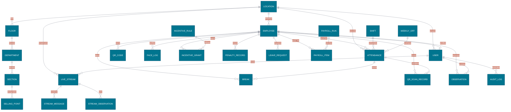
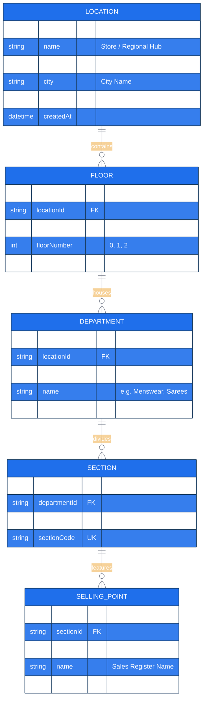
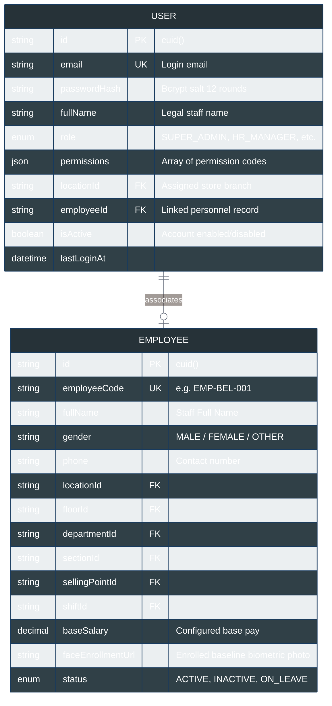
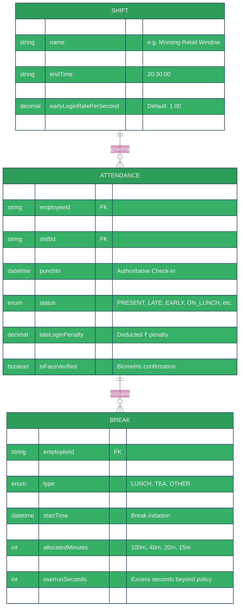
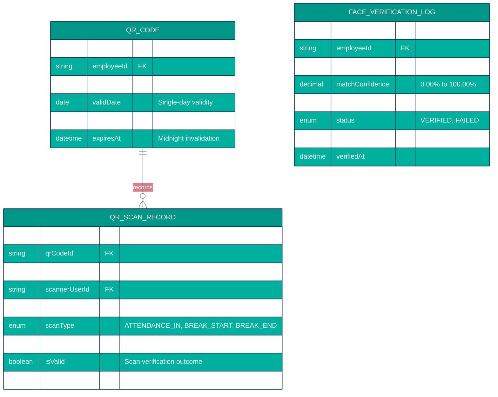
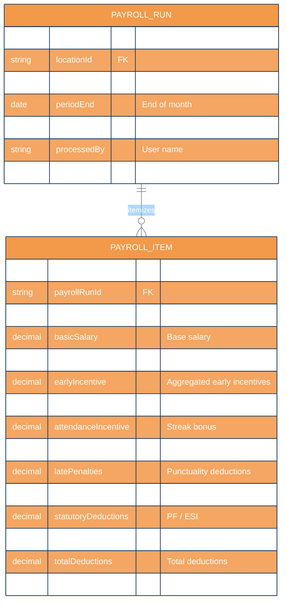

# BSC Textiles HRMS — Master Database & Backend Schema Specification

```text
BSC Textiles Pvt Ltd
Weaving Dreams, Building Futures
Document: Master Backend & Database Schema Architecture (backend_schema.md)
Version: 1.0.0 (Production Architecture)
Database: MySQL 8.0 Enterprise Community Server
ORM: Prisma Client 5.7
```

---

## 1. Executive Schema Overview

The **BSC Textiles HRMS** data layer is structured around an enterprise-grade 3NF normalized relational schema implemented on **MySQL 8.0** and managed via **Prisma ORM**.

### Architectural Tenets
1. **Multi-Location Data Isolation:** Store branches (`Belagavi`, `Davanagere`, `Shivamogga`, `Hubballi`) are strictly partitioned using foreign key relational scoping anchored on `locationId`.
2. **Sub-Second Temporal Precision:** Authoritative timestamps (`punchIn`, `punchOut`, `startTime`, `endTime`, `processedAt`) use server-managed MySQL `DATETIME(3)` with microsecond precision.
3. **Audit Non-Repudiation:** Core operational tables implement immutable transaction logging (`AuditLog`, `QRScanRecord`, `FaceVerificationLog`).
4. **Referential Integrity:** Enforces relational foreign keys, composite indexes, and strict cascade rules (`Cascade` on child items, `Restrict` on core organizational masters).

---

## 2. Master Entity-Relationship Diagram (ERD)



---

## 3. Domain ERDs & Functional Sub-Schemas

### 3.1 Organizational Topology Sub-Schema



### 3.2 Identity, Authentication & Role Access Sub-Schema



### 3.3 Time, Attendance & Break Sub-Schema



### 3.4 QR & Biometric Verification Sub-Schema



### 3.5 Payroll & Compensation Sub-Schema



---

## 4. Master Enums Reference

| Enum Name | Defined Values | Application Semantics |
|---|---|---|
| `UserRole` | `SUPER_ADMIN`, `ADMIN`, `HR_MANAGER`, `HR_EXECUTIVE`, `PAYROLL_MANAGER`, `LOCATION_MANAGER`, `FLOOR_MANAGER`, `DEPARTMENT_MANAGER`, `TEAM_LEAD`, `SALES_EMPLOYEE`, `TEA_BREAK_MANAGER`, `T_SHOP_OWNER`, `HR_AUDITOR`, `EMPLOYEE` | System role catalog establishing base permissions and navigation authority. |
| `Permission`| `VIEW`, `ADD`, `EDIT`, `DELETE`, `APPROVE`, `REJECT`, `ASSIGN`, `EXPORT`, `IMPORT`, `CONFIGURE`, `MANAGE`, `RECORD`, `UPLOAD`, `PUBLISH`, `SCAN`, `VIEW_SENSITIVE_DATA` | Granular permission flags checked dynamically per endpoint. |
| `AttendanceStatus`| `PRESENT`, `ABSENT`, `LATE`, `EARLY`, `ON_LUNCH`, `ON_TEA_BREAK`, `ON_OTHER_BREAK`, `WEEKLY_OFF`, `OVERTIME`, `LEFT_STORE`, `FACE_VERIFIED`, `FACE_VERIFICATION_FAILED` | Real-time presence state machine indicators. |
| `BreakType` | `LUNCH`, `TEA`, `OTHER` | Policy classification governing gendered duration limits. |
| `BreakStatus`| `NOT_STARTED`, `ACTIVE`, `COMPLETED`, `EXCEEDED`, `MANUALLY_ADJUSTED` | Break state machine tracking counter duration and overruns. |
| `LocationStatus`| `ACTIVE`, `INACTIVE`, `ARCHIVED` | Store operational status. |
| `FloorStatus`| `ACTIVE`, `INACTIVE` | Showroom floor operational availability. |
| `EmployeeStatus`| `ACTIVE`, `INACTIVE`, `ON_LEAVE`, `TERMINATED` | Staff HR status governing roster and login permissions. |

---

## 5. Performance Indexes & Data Integrity Rules

### Composite Performance Indexes
1. `Attendance_employeeId_attendanceDate_idx`: Accelerates single-employee daily punch lookups.
2. `Attendance_locationId_attendanceDate_idx`: Optimizes branch-wide daily muster roll rendering.
3. `QRCode_token_validDate_idx`: Guarantees sub-millisecond barcode validation on scanner terminals.
4. `Break_employeeId_status_idx`: Delivers instant lookups for active floor break monitoring.
5. `AuditLog_userId_createdAt_idx`: Powers fast compliance and non-repudiation audit filtering.

### Cascade & Deletion Behaviors
- **`ON DELETE CASCADE`:** Applied to ephemeral records (`PayrollItem` under `PayrollRun`, `Break` under `Attendance`).
- **`ON DELETE RESTRICT`:** Applied to organizational master nodes (`Location`, `Floor`, `Department`, `Employee`). Prevents catastrophic accidental data loss when deleting parent entities with historical muster records.
