# BSC TEXTILES HRMS

## Functional Design Requirements (FDR)

**Product:** BSC Textiles HRMS – Next Generation Workforce Management System
**Company:** BSC Textiles Pvt Ltd
**Document Type:** Functional Design Requirements (FDR)
**Version:** 1.0
**Status:** Production Design Specification
**Architecture:** React.js + Next.js + MySQL + Prisma
**Primary Locations:** Belagavi (BEL), Davanagere (DAV), Shivamogga (SHI)

---

# 1. PURPOSE

This Functional Design Requirements document defines exactly how the BSC Textiles HRMS must behave from the user interface through the backend, business logic, database, realtime services, security layer, reporting system, and external integrations.

This document must be treated as the **functional implementation reference** for development.

The system must be a real working enterprise application.

There must be:

* No static mock screens
* No fake dashboard values
* No placeholder APIs
* No localStorage-based business database
* No broken buttons
* No unauthorized data access
* No unfinished modules

---

# 2. FUNCTIONAL ARCHITECTURE

The system operates using the following transaction pipeline:

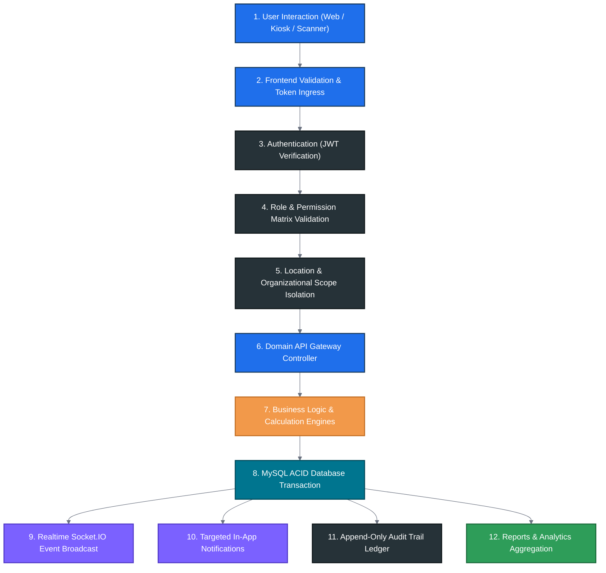

Every important transaction must follow this architecture.

---

# 3. APPLICATION MODULES

The application must contain the following functional modules:

```text
1. Dashboard
2. Authentication
3. User Management
4. Role Management
5. Permission Management
6. Location Management
7. Floor Management
8. Department Management
9. Section Management
10. Selling Point Management
11. Employee Management
12. Attendance
13. Break Management
14. Shift Management
15. Weekly Off
16. Leave Management
17. Face Verification
18. QR Management
19. Incentive Management
20. Penalty Management
21. Payroll
22. Observations
23. Video Notes
24. Live Streaming
25. Live Chat
26. Notifications
27. Reports
28. Audit Logs
29. Device Integration
30. System Settings
```

---

# 4. AUTHENTICATION FUNCTIONAL REQUIREMENTS

## 4.1 Login

User enters:

* Email/mobile/username
* Password

System must:

1. Validate credentials
2. Validate account status
3. Validate session policy
4. Load roles
5. Load permissions
6. Load location scope
7. Create secure session
8. Write login audit event
9. Redirect to authorized dashboard

Failed login:

* Increment failed-login counter
* Record audit event
* Apply rate limiting where required
* Display safe error message

Do not expose whether a username exists.

---

# 5. SESSION MANAGEMENT

Support:

* Active sessions
* Device information
* Login date/time
* Last activity
* Logout
* Forced logout
* Session expiration
* Password-change session invalidation

Admin must be able to view and revoke sessions according to permission.

---

# 6. ROLE FUNCTIONAL DESIGN

Roles are dynamically configurable.

Each role contains:

* Role ID
* Name
* Description
* Status
* Permissions
* Location scope
* Floor scope
* Department scope
* Employee scope where required

Admin can:

* Create
* Edit
* Deactivate
* Assign
* Remove
* Duplicate
* Review permissions

---

# 7. PERMISSION FUNCTIONAL DESIGN

Each permission must be independently configurable.

Supported operations:

```text
VIEW
ADD
EDIT
DELETE
APPROVE
REJECT
ASSIGN
EXPORT
IMPORT
CONFIGURE
MANAGE
RECORD
UPLOAD
PUBLISH
SCAN
VIEW_SENSITIVE_DATA
```

Backend must always verify permission.

Frontend visibility alone is not sufficient.

---

# 8. LOCATION SECURITY

Every location-sensitive API must determine the current user's permitted scope before querying data.

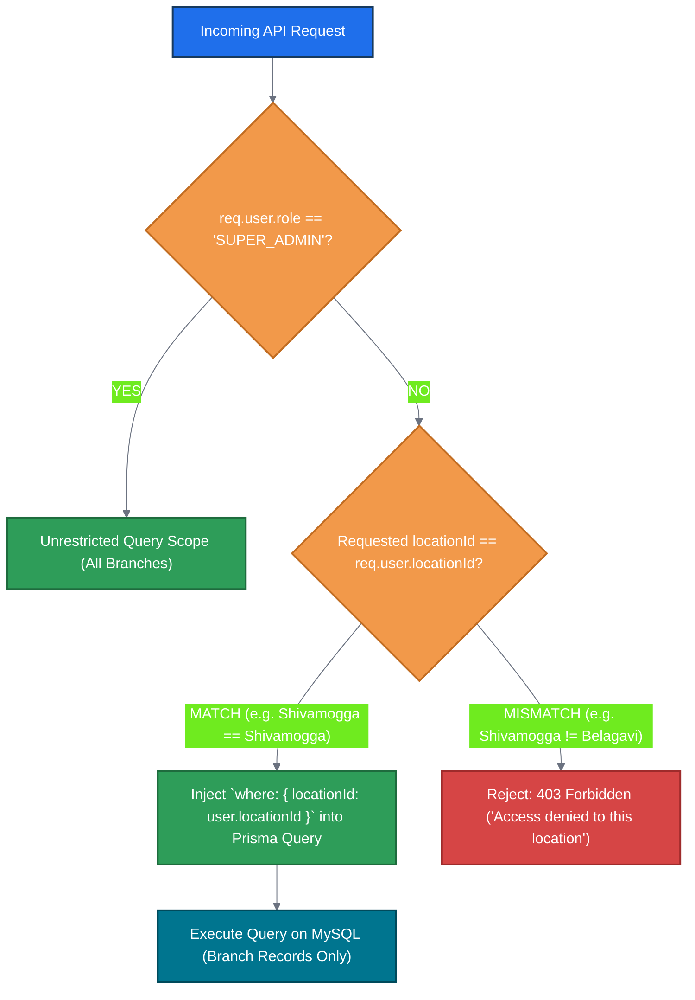

The backend must not query unrestricted records and then filter them in the browser.

The database query itself should contain the correct authorization scope whenever possible.

---

# 9. ORGANIZATION MASTER DATA

## 9.1 Location

Fields:

* ID
* Code
* Name
* Address
* Phone
* Email
* Working hours
* Timezone
* Status
* Manager
* Configuration

Operations:

* Add
* Edit
* Activate
* Deactivate
* Assign users
* Configure rules
* View reports

---

# 10. FLOOR MANAGEMENT

Floor fields:

* Floor ID
* Location
* Name
* Floor number
* Manager
* Status

Functions:

* Add floor
* Edit floor
* Assign manager
* Assign departments
* Assign sections
* Assign selling points
* Assign employees
* Configure targets
* View floor dashboard

---

# 11. DEPARTMENT MANAGEMENT

Fields:

* Department
* Code
* Location
* Manager
* Status

Functions:

* Create
* Edit
* Activate
* Deactivate
* Assign employees
* Assign selling points
* View department reports

---

# 12. SECTION MANAGEMENT

Hierarchy:

```text
Location
 ↓
Floor
 ↓
Department
 ↓
Section
```

Sections must support employee assignment and reporting.

---

# 13. SELLING POINT FUNCTIONAL DESIGN

Fields:

* Selling point ID
* Name
* Code
* Location
* Floor
* Section
* Manager
* Employees
* Target
* Incentive rule
* Status

Selling point dashboard:

* Employees
* Present
* Absent
* Late
* On break
* Performance
* Target
* Observations
* Alerts

---

# 14. EMPLOYEE FUNCTIONAL DESIGN

Employee creation workflow:

```text
Basic Information
 ↓
Employment Information
 ↓
Organization Assignment
 ↓
Shift
 ↓
Weekly Off
 ↓
Attendance Configuration
 ↓
QR
 ↓
Face Verification
 ↓
Documents
 ↓
Review
 ↓
Save
```

After save:

* Employee record created
* Employee ID assigned
* QR identity generated
* Audit log created
* Relevant notifications generated

---

# 15. EMPLOYEE PROFILE

Profile tabs:

```text
Overview
Attendance
Breaks
Leave
Shift
Weekly Off
Face Verification
QR
Incentives
Payroll
Observations
Performance
Training
Documents
Audit History
```

All tabs must obey permissions.

---

# 16. ATTENDANCE FUNCTIONAL DESIGN

Attendance statuses:

```text
PRESENT
ABSENT
LATE
EARLY_LOGIN
OVERTIME
HALF_DAY
LEAVE
WEEKLY_OFF
HOLIDAY
ON_BREAK
```

Attendance must support event-level records:

```text
LOGIN
LOGOUT
BREAK_START
BREAK_END
MANUAL_CORRECTION
DEVICE_EVENT
FACE_VERIFICATION
```

---

# 17. ATTENDANCE CALCULATION

System must calculate:

* Scheduled time
* Actual login
* Grace period
* Early seconds
* Late seconds
* Scheduled logout
* Early logout
* Overtime
* Worked duration
* Break duration
* Break overrun

Calculation must be performed server-side.

---

# 18. GRACE PERIOD

Example configuration:

```text
Scheduled Login: 10:30:00
Grace Period: 00:05:00
Threshold: 10:35:00
```

If login occurs at:

```text
10:34:59 → within grace
10:35:00 → threshold reached
10:35:01 → late calculation begins
```

All calculations must use exact timestamp precision.

---

# 19. EARLY LOGIN INCENTIVE

System must support:

```text
Early Seconds × Rate
```

Example:

```text
10:30 scheduled
10:20 actual
600 seconds early
Rate ₹1/second
Total ₹600
```

The rate must be configurable.

The system must show the calculation breakdown.

---

# 20. LATE CALCULATION

Example:

```text
Threshold = 10:35
Actual = 10:42

Late = 7 minutes
= 420 seconds
```

The system must store:

* Late seconds
* Applied rule
* Applied rate
* Calculated value
* Approval status

Any payroll deduction must require configured authorization/policy.

---

# 21. LOGOUT FUNCTIONAL DESIGN

At logout calculate:

```text
Scheduled Logout
Actual Logout
Early Logout
Overtime
Applicable Grace
Applicable Incentive/Penalty
```

Every calculation must be recorded.

---

# 22. BREAK RULE ENGINE

Break rules must not be hard-coded.

Rule dimensions may include:

* Employee group
* Location
* Department
* Floor
* Shift
* Role
* Effective date

System selects the highest-priority applicable rule.

---

# 23. LUNCH FUNCTIONAL REQUIREMENTS

Example default policy:

```text
Group A: 1 hour 40 minutes
Group B: 40 minutes
```

But all durations must be configurable.

Lunch workflow:

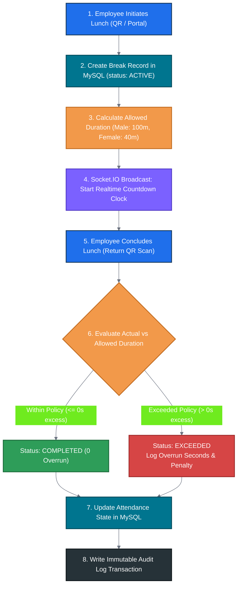

---

# 24. TEA BREAK FUNCTIONAL REQUIREMENTS

Example:

```text
Group A: 20 minutes
Group B: 15 minutes
```

Optionally:

```text
Company-wide: 20 minutes
```

Tea break must support QR initiation.

---

# 25. BREAK TIMER

Frontend must show:

```text
Break Type
Start Time
Allowed Time
Elapsed Time
Remaining Time
Overrun Time
```

Realtime updates must not require page refresh.

---

# 26. BREAK EXPIRATION

When allowed duration is exceeded:

1. Update break state
2. Create event
3. Notify authorized users
4. Display warning
5. Calculate overrun
6. Store audit entry

---

# 27. WEEKLY-OFF ENGINE

Rules can be assigned:

* Individually
* By shift
* By department
* By floor
* By location

Support:

* Fixed weekly off
* Rotational weekly off
* Alternate weekly off
* Custom date schedules

---

# 28. SHIFT MANAGEMENT

Shift contains:

* Shift ID
* Name
* Start time
* End time
* Grace period
* Break policy
* Weekly-off rule
* Overtime configuration
* Status

Employees can be assigned to shifts.

Historical attendance must retain the applicable shift rule used at the time.

---

# 29. LEAVE MANAGEMENT

Support:

* Leave types
* Leave balance
* Leave application
* Approval
* Rejection
* Cancellation
* Leave history

Leave status:

```text
PENDING
APPROVED
REJECTED
CANCELLED
```

Approved leave must affect attendance calculations.

---

# 30. FACE VERIFICATION

Workflow:

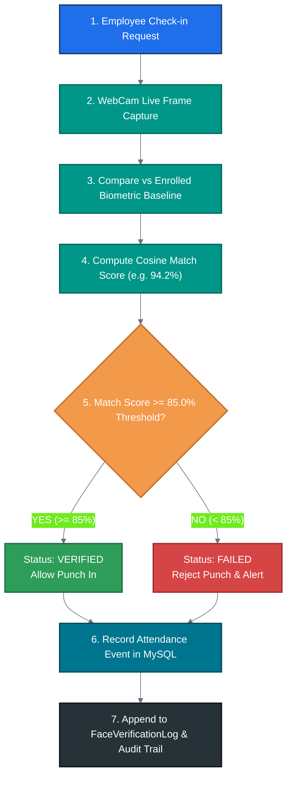

Store actual provider score.

Do not generate fake percentages.

---

# 31. FACE MATCH DISPLAY

Example:

```text
Face Match
97.42%

Required Threshold
85%

Status
VERIFIED
```

The system must retain historical verification records.

---

# 32. QR GENERATION

At daily QR generation:

1. Identify active employee
2. Generate cryptographically secure token
3. Associate token with employee/date
4. Set expiration
5. Store hash/reference where appropriate
6. Generate QR image/display representation
7. Activate token

Previous-day token must no longer be valid.

---

# 33. QR SCANNING

Scanner workflow:

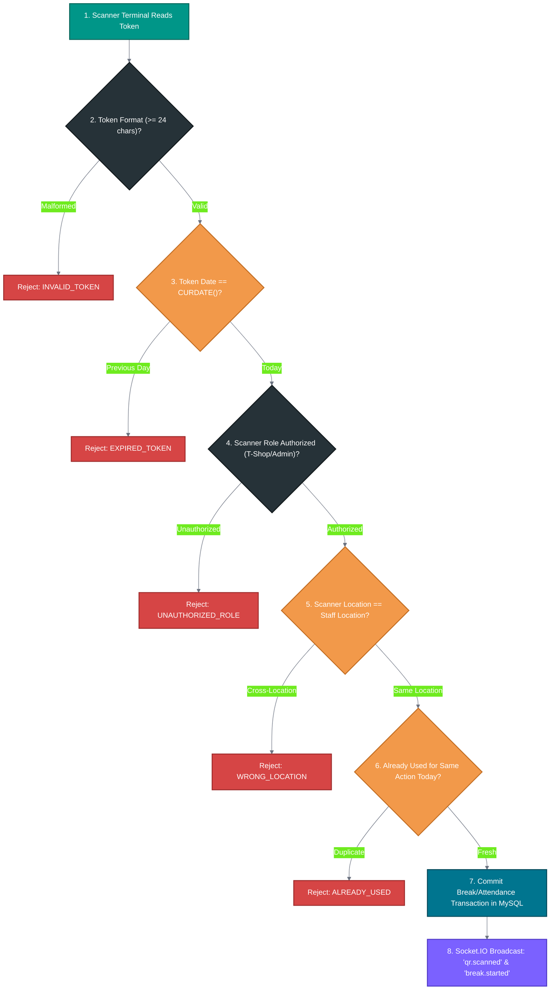

---

# 34. QR SUCCESS

Display:

```text
Employee Name
Employee ID
Location
Floor
Break Type
Start Time
Allowed Duration
Remaining Duration
```

Create:

* QR scan record
* Break record
* Attendance event
* Audit record
* Realtime event

---

# 35. QR DUPLICATE

Second scan must not create a new transaction.

Display:

```text
This QR code has already been scanned for today.
```

Store duplicate attempt in the QR audit history.

---

# 36. QR FAILURE

Possible failure codes:

```text
INVALID_TOKEN
EXPIRED_TOKEN
PREVIOUS_DAY
ALREADY_USED
UNAUTHORIZED_ROLE
WRONG_LOCATION
EMPLOYEE_INACTIVE
TOKEN_TAMPERED
```

Display a simple user-facing message while storing the detailed technical reason internally.

---

# 37. INCENTIVE ENGINE

The engine must evaluate active incentive rules.

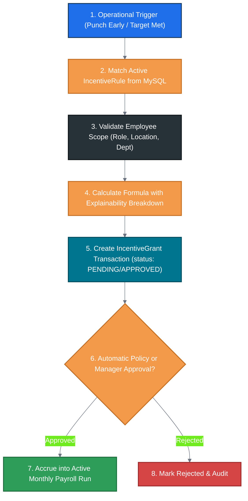

---

# 38. INCENTIVE TYPES

Support:

* Attendance
* Early login
* Overtime
* Sales
* Target
* Performance
* Department
* Location
* Floor
* Selling point
* Individual
* Custom

---

# 39. PENALTY ENGINE

Support configurable penalties for:

* Late
* Early logout
* Break overrun
* Other authorized policies

Every penalty must have:

* Rule
* Reason
* Calculation
* Approval
* Audit

---

# 40. PAYROLL FUNCTIONAL FLOW

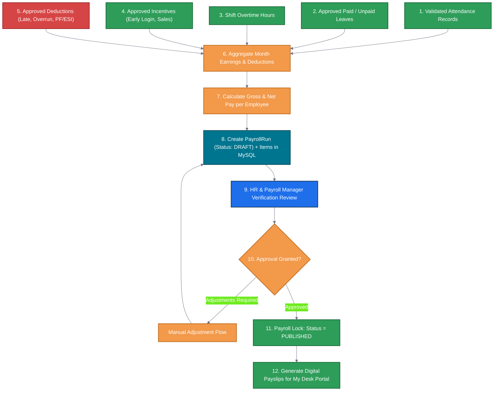

Locked payroll must not be silently changed.

Corrections require authorized adjustment/audit flow.

---

# 41. OBSERVATION FUNCTIONAL FLOW

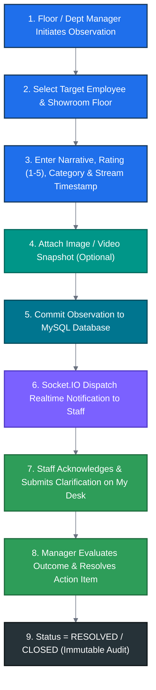

---

# 42. OBSERVATION STATUS

Support:

```text
OPEN
ACKNOWLEDGED
IN_PROGRESS
REVIEWING
RESOLVED
CLOSED
REJECTED
```

---

# 43. OBSERVATION CHAT

Each observation has an independent conversation.

Features:

* Message
* Reply
* Mention
* Reaction
* Attachment
* Edit
* Delete
* Timestamp

Use realtime messaging where available.

---

# 44. VIDEO OBSERVATION

Users with permission can:

* Start camera
* Record
* Stop
* Preview
* Upload
* Attach
* Add description
* Save observation

Video must have controlled access.

---

# 45. LIVE STREAM FUNCTIONAL DESIGN

Stream lifecycle state machine:

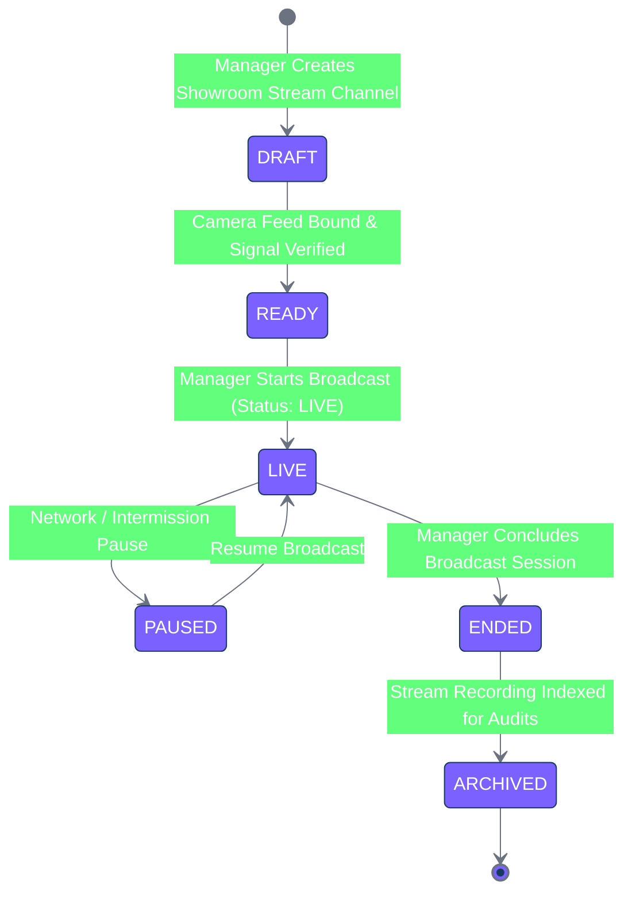

Only authorized roles can start or stop streams.

---

# 46. LIVE STREAM ACCESS

Access must consider:

* Role
* Location
* Department
* Floor
* Stream visibility
* User permission

A user from one location must not automatically see confidential streams from another location.

---

# 47. LIVE STREAM CHAT

Messages:

* Send
* Edit where allowed
* Delete
* Reply
* Mention
* React
* Moderate
* Pin

Chat must persist.

---

# 48. TIMESTAMPED LIVE OBSERVATION

During live streaming:

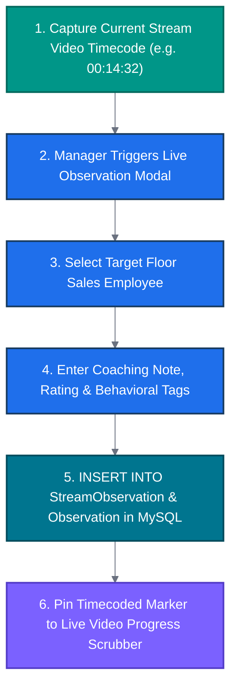

The observation must retain the relevant stream timestamp.

---

# 49. NOTIFICATION ENGINE

Notification sources:

* Attendance
* Break
* QR
* Face
* Observation
* Payroll
* Incentive
* Security
* System

Each notification contains:

* ID
* User
* Type
* Title
* Message
* Link/context
* Read status
* Priority
* Created time

---

# 50. REALTIME EVENT ENGINE

Backend publishes events after successful database transactions:

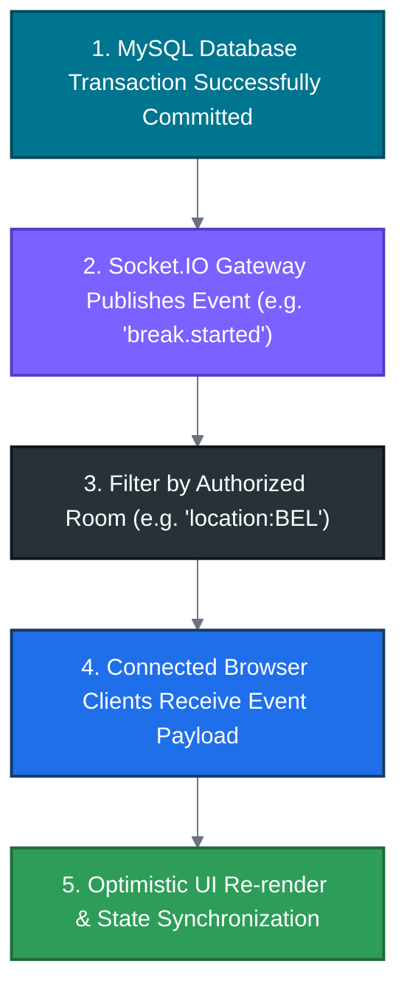

Do not publish false events before database commit.

---

# 51. DASHBOARD DATA

Dashboard queries must aggregate real database records.

Examples:

```text
Present Employees
Late Employees
Absent Employees
Employees on Break
Face Verification
QR Activity
Observations
Incentives
Payroll
```

No hard-coded counters.

---

# 52. REPORT ENGINE

Reports must use server-side queries.

Support:

* Filter
* Sort
* Pagination
* Grouping
* Totals
* Export

Large reports should be processed asynchronously where appropriate.

---

# 53. AUDIT ENGINE

Audit record creation must occur for security-sensitive actions.

Minimum fields:

```text
Audit ID
User
Action
Module
Record ID
Old Data
New Data
Timestamp
IP
Device
Result
```

Sensitive data must be protected.

---

# 54. MANUAL ATTENDANCE CORRECTION

Authorized HR/Admin can edit:

* Login
* Logout
* Break start
* Break end

Required:

* Reason
* Old value
* New value
* Changed by
* Timestamp

The original event must remain traceable.

---

# 55. ADMIN CONFIGURATION ENGINE

Admin must be able to configure:

* Locations
* Floors
* Departments
* Sections
* Selling points
* Roles
* Permissions
* Shifts
* Attendance rules
* Break rules
* Weekly offs
* Incentives
* Penalties
* Face thresholds
* QR policies
* Notification rules
* Devices
* Streaming settings

---

# 56. DATA FILTERING RULE

Every screen must load only what the logged-in user is authorized to see.

Example:

```text
Shivamogga HR
→ Shivamogga employees only
→ Shivamogga attendance only
→ Shivamogga QR only
→ Shivamogga observations only
```

Changing the URL must not bypass this.

---

# 57. ERROR FUNCTIONAL DESIGN

Common errors must have standard responses:

```text
401 → Authentication required
403 → Permission denied
404 → Record not found
409 → Duplicate/conflict
422 → Validation error
429 → Rate limit
500 → Internal error
503 → Temporary service unavailable
```

Frontend should show meaningful messages.

Never expose server stack traces.

---

# 58. REALTIME FAILURE RECOVERY

When WebSocket disconnects:

1. Detect disconnect
2. Display subtle status
3. Reconnect automatically
4. Re-authenticate if required
5. Re-subscribe to authorized channels
6. Synchronize missed state
7. Remove temporary connection alert after recovery

Do not force full-page reload.

---

# 59. SEARCH

Global search, where enabled, must be permission aware.

Searchable entities may include:

* Employees
* Locations
* Departments
* Selling points
* Attendance
* Observations
* Documents

Never return records outside authorization scope.

---

# 60. FILE UPLOAD FUNCTIONAL DESIGN

Before accepting a file:

* Validate extension
* Validate MIME type
* Validate size
* Validate authorization
* Sanitize filename
* Store securely
* Generate unique file reference
* Audit upload

Do not trust client-provided file metadata.

---

# 61. DATABASE FUNCTIONAL REQUIREMENTS

All critical business actions must use transactions.

Example:

### QR transaction

```text
Validate Token
+
Validate Permissions
+
Create Scan
+
Create Break
+
Create Attendance Event
+
Create Audit
```

Either all required records are committed or the operation fails safely.

---

# 62. ARCHIVING

Employee/location/user records should normally support:

```text
ACTIVE
INACTIVE
ARCHIVED
```

Historical records must remain available according to permission.

---

# 63. REPORT EXPORT SECURITY

Exports must respect:

* User permissions
* Location restrictions
* Sensitive-data permissions
* Date limits
* Report scope

A location-restricted user must never export all-company data.

---

# 64. PERFORMANCE FUNCTIONAL REQUIREMENTS

The application must:

* Paginate large tables
* Query only required fields
* Use indexes
* Avoid unnecessary joins
* Cache safe reference data
* Process heavy exports asynchronously
* Use background jobs where appropriate

---

# 65. BACKGROUND JOBS

Use scheduled/background jobs for:

* Daily QR generation
* QR expiration
* Notifications
* Break alerts
* Attendance calculations
* Payroll processing
* Report generation
* Cleanup
* Data archival

Jobs must be idempotent.

---

# 66. DAILY QR JOB

Every day:

```text
Find Active Employees
 ↓
Create Daily Tokens
 ↓
Invalidate Prior Tokens
 ↓
Publish Availability
```

Do not create duplicate tokens when the job executes again.

---

# 67. NOTIFICATION JOB

Scheduled notification processing must:

* Identify eligible users
* Check preferences
* Create notification
* Deliver channel
* Record status
* Retry failures

---

# 68. DATA RETENTION

Configure retention for:

* Attendance
* QR logs
* Face verification
* Audit
* Notifications
* Live stream metadata
* Chat
* Media references

Do not delete required legal/business records automatically without configuration.

---

# 69. SECURITY FUNCTIONAL TESTS

Test:

```text
Unauthorized API
Unauthorized Location
Unauthorized Employee
Unauthorized QR
Duplicate QR
Expired QR
Invalid Session
Expired Session
Invalid File
Rate Limit
Invalid Input
```

All must fail safely.

---

# 70. TEST USERS

Create synthetic test users such as:

```text
TEST-SUPERADMIN
TEST-ADMIN
TEST-HR-BEL
TEST-HR-DAV
TEST-HR-SHI
TEST-FLOOR-BEL
TEST-EMP-001
TEST-TSHOP-001
TEST-VIEWER-001
```

No real personal information.

---

# 71. ACCEPTANCE CRITERIA

## Authentication

User can login and logout correctly.

## Authorization

Users can only access permitted modules and data.

## Location

Location-restricted users cannot access another location through UI or API manipulation.

## Attendance

Attendance calculations match configured rules.

## Breaks

Break timers and overrun calculations are correct.

## QR

Only valid daily QR codes can create transactions.

## Face

Actual provider score is displayed and correctly compared with threshold.

## Incentive

Calculation is transparent and correct.

## Payroll

Only approved transactions enter payroll.

## Observations

Observation, attachment, chat, reaction and status changes persist.

## Live Stream

Authorized users can manage genuine streaming sessions.

## Reports

Reports reflect actual stored data.

## Audit

Sensitive actions produce audit entries.

## Realtime

Updates appear without full-page refresh.

---

# 72. FUNCTIONAL TRACEABILITY

Every requirement must map to:

```text
Requirement
 ↓
Frontend Screen
 ↓
Frontend Action
 ↓
API Endpoint
 ↓
Backend Service
 ↓
Database Table
 ↓
Realtime Event
 ↓
Notification
 ↓
Audit Log
 ↓
Report
```

No functional requirement should exist without an implementation path.

---

# 73. DEVELOPMENT RULES

Develop feature-by-feature using domain modules.

Do not create huge files.

Do not put all logic into:

```text
one component
one API route
one service
one database file
```

Business logic must be reusable.

---

# 74. DATABASE RULES

Never use:

* Fake arrays
* Hard-coded dashboard values
* Browser localStorage as primary database
* Temporary in-memory records for important business data

Use MySQL through Prisma for persistent business records.

---

# 75. FRONTEND RULES

Every page must have:

* Loading state
* Empty state
* Error state
* Permission state
* Responsive state

Forms must provide:

* Validation
* Submit state
* Success feedback
* Error feedback
* Unsaved-change protection where necessary

---

# 76. MOBILE FUNCTIONAL DESIGN

Mobile users must be able to use:

* Attendance
* QR scanning
* Notifications
* Employee status
* Break timer
* Observation
* Chat

Desktop users must receive full administrative capabilities according to permissions.

---

# 77. CAMERA FUNCTIONAL DESIGN

Camera must:

* Start only after explicit user action
* Request browser permission
* Stop when leaving screen
* Release media tracks
* Provide fallback error handling
* Support QR scanning
* Support face workflow where configured
* Support video observation

---

# 78. ENVIRONMENT SEPARATION

Support:

```text
Development
Testing
Staging
Production
```

No production secrets in source code.

---

# 79. LOGGING

Log:

* Errors
* Security events
* API errors
* Background jobs
* Device events
* Realtime failures

Do not log:

* Passwords
* API secrets
* Access tokens
* Highly sensitive personal information unnecessarily

---

# 80. FINAL FUNCTIONAL ACCEPTANCE

The complete system must be tested from beginning to end.

Example:

```text
Create Employee
 ↓
Assign Location
 ↓
Assign Floor
 ↓
Assign Department
 ↓
Assign Selling Point
 ↓
Assign Shift
 ↓
Generate Daily QR
 ↓
Employee Login
 ↓
Face Verification
 ↓
Attendance Created
 ↓
Tea Break QR
 ↓
Break Timer
 ↓
Break End
 ↓
Observation
 ↓
Chat/Reaction
 ↓
Live Stream
 ↓
Timestamped Observation
 ↓
Incentive
 ↓
Payroll
 ↓
Report
 ↓
Audit
```

Every stage must work using real persisted data.

---

# 81. FINAL DELIVERY REQUIREMENTS

Deliver:

```text
Frontend
+
Backend
+
Database
+
Prisma Schema
+
Migrations
+
Seed Data
+
APIs
+
Authentication
+
Authorization
+
Realtime
+
Reports
+
Audit
+
Testing
+
Documentation
```

The delivered application must be production-ready and modular.

The implementation must follow this FDR as the functional source of truth and the PRD as the overall product specification.

**Do not declare the project complete until all functional flows, permissions, database persistence, security controls, realtime behavior, testing, and reporting have been validated.**
