# BSC TEXTILES HRMS

## PRODUCTION IMPLEMENTATION PLAN

**Product:** BSC Textiles HRMS – Next Generation Workforce Management System
**Company:** BSC Textiles Pvt Ltd
**Document Type:** Implementation Plan
**Version:** 1.0
**Status:** Production Execution Specification
**Architecture:** React.js + TypeScript + Next.js + MySQL + Prisma
**Primary Timezone:** Asia/Kolkata

---

# 1. PURPOSE

This Implementation Plan defines exactly how the BSC Textiles HRMS must be implemented from the existing project/repository through production deployment.

It connects:


The development team or coding agent must use this document as the execution roadmap.

Do not attempt to build every feature as isolated pages.

Build the system in dependency order so that:

* Database exists before dependent APIs
* APIs exist before dependent UI
* Authorization exists before business modules
* Core employee data exists before attendance
* Attendance exists before incentives/payroll
* Realtime infrastructure exists before realtime features
* Storage exists before media features
* Testing is performed continuously rather than only at the end

---

# 2. IMPLEMENTATION OBJECTIVES

The implementation must produce:

* Working frontend
* Working backend
* Working MySQL database
* Prisma schema and migrations
* Authentication
* RBAC
* Location-based security
* Employee management
* Attendance
* Break management
* QR system
* Face verification integration
* Incentive engine
* Payroll integration
* Observations
* Video/media handling
* Live streaming architecture
* Realtime events
* Notifications
* Reports
* Audit logging
* Background jobs
* Testing
* Documentation
* Production deployment configuration

No module should be declared complete while its backend, database, authorization, testing, and error handling are incomplete.

---

# 3. IMPLEMENTATION PRINCIPLES

## 3.1 Build in dependency order

Never build a UI first and leave its backend for later.

## 3.2 Build vertical slices

For important workflows, implement:

```text
Database
+
Backend
+
Authorization
+
API
+
Frontend
+
Realtime
+
Audit
+
Testing
```

together.

## 3.3 Preserve existing functionality

The project may already contain working:

* Wedding CRM
* Wedding registration
* Telecaller
* Customer management
* Feedback
* VM
* Live TV
* Store operations

Do not break existing functionality.

## 3.4 Avoid destructive rewrites

Before changing existing architecture:

1. Inspect it.
2. Identify dependencies.
3. Migrate safely.
4. Test existing routes.
5. Preserve data.

---

# 4. IMPLEMENTATION PHASES

Implement in the following phases:

```text
PHASE 0  Repository Assessment
PHASE 1  Foundation
PHASE 2  Database & Prisma
PHASE 3  Authentication & Security
PHASE 4  Organization & Employee Master
PHASE 5  Attendance Engine
PHASE 6  Break & Weekly-Off Engine
PHASE 7  QR System
PHASE 8  Face Verification
PHASE 9  Incentive & Penalty Engine
PHASE 10 Payroll
PHASE 11 Observations & Performance
PHASE 12 Realtime & Notifications
PHASE 13 Live Operations & Media
PHASE 14 Reports & Analytics
PHASE 15 Device Integrations
PHASE 16 Full Testing
PHASE 17 Staging
PHASE 18 Production Deployment
PHASE 19 Post-Production Hardening

```mermaid
%%{init: {'theme': 'base', 'themeVariables': { 'primaryColor': '#1F6FEB', 'primaryTextColor': '#FFFFFF', 'primaryBorderColor': '#173A5E', 'lineColor': '#6B7280' }}}%%
flowchart TD
    subgraph PHASE_INIT["Phase Group A: Core Infrastructure"]
        P0["Phase 0: Assessment"]:::cDark --> P1["Phase 1: Foundation"]:::cDark
        P1 --> P2["Phase 2: Database & Prisma"]:::cDb
        P2 --> P3["Phase 3: Auth & Security"]:::cDark
        P3 --> P4["Phase 4: Org & Employee Masters"]:::cBlue
    end

    subgraph PHASE_OPS["Phase Group B: Operations & Biometrics"]
        P4 --> P5["Phase 5: Attendance Engine"]:::cGreen
        P5 --> P6["Phase 6: Breaks & Weekly-Offs"]:::cGreen
        P6 --> P7["Phase 7: Daily QR Tokens"]:::cTeal
        P7 --> P8["Phase 8: Face Verification"]:::cTeal
    end

    subgraph PHASE_COMP["Phase Group C: Compensation & Operations"]
        P8 --> P9["Phase 9: Incentives & Penalties"]:::cOrange
        P9 --> P10["Phase 10: Multi-Branch Payroll"]:::cOrange
        P10 --> P11["Phase 11: Observations"]:::cPurple
        P11 --> P12["Phase 12: Realtime & Alerts"]:::cPurple
        P12 --> P13["Phase 13: Live Streaming"]:::cPurple
        P13 --> P14["Phase 14: Reports & Analytics"]:::cBlue
        P14 --> P15["Phase 15: Device Hardware"]:::cTeal
    end

    subgraph PHASE_RELEASE["Phase Group D: Testing & Deployment"]
        P15 --> P16["Phase 16: Automated Testing (Sec 60)"]:::cOrange
        P16 --> P17["Phase 17: Staging Validation"]:::cPurple
        P17 --> P18["Phase 18: Production Deployment"]:::cGreen
        P18 --> P19["Phase 19: Post-Production Hardening"]:::cDark
    end

    classDef cBlue fill:#1F6FEB,stroke:#173A5E,stroke-width:2px,color:#FFFFFF;
    classDef cGreen fill:#2E9D59,stroke:#1E6B3D,stroke-width:2px,color:#FFFFFF;
    classDef cOrange fill:#F2994A,stroke:#C26D22,stroke-width:2px,color:#FFFFFF;
    classDef cPurple fill:#7B61FF,stroke:#523BC7,stroke-width:2px,color:#FFFFFF;
    classDef cTeal fill:#009688,stroke:#00675B,stroke-width:2px,color:#FFFFFF;
    classDef cDark fill:#263238,stroke:#10171A,stroke-width:2px,color:#FFFFFF;
    classDef cDb fill:#00758F,stroke:#004A5B,stroke-width:2px,color:#FFFFFF;
```


---

# 5. PHASE 0 — REPOSITORY ASSESSMENT

Before modifying code, perform a complete technical audit.

Inspect:

```text
frontend/package.json
backend/package.json
database/package.json
Prisma schema
Prisma migrations
Existing API routes
Existing frontend routes
Existing authentication
Existing database connection
Existing environment files
Existing realtime implementation
Existing file storage
Existing tests
Existing scripts
Existing README
```

Create an implementation inventory.

Classify every existing feature:

```text
WORKING
PARTIALLY WORKING
BROKEN
MISSING
DUPLICATE
OBSOLETE
```

Do not immediately replace existing code.

---

# 6. PHASE 0 DELIVERABLES

Produce:

```text
Architecture Assessment
Feature Inventory
Database Assessment
API Inventory
Route Inventory
Dependency Map
Known Bugs
Migration Risks
Implementation Gap Report
```

Identify all conflicts before development begins.

---

# 7. PHASE 1 — FOUNDATION

Establish the base project structure.

Required root:

```text
BSC-Textiles-HRMS/
├── frontend/
├── backend/
├── database/
├── README.md
└── .gitignore
```

Establish:

* TypeScript configuration
* Formatting
* Linting
* Environment configuration
* Shared conventions
* Error handling
* Logging
* API response standards

---

# 8. PHASE 1 — ENVIRONMENT SETUP

Create and document:

```text
Development
Testing
Staging
Production
```

Create:

```text
.env.example
```

Never commit production secrets.

Validate environment loading at startup.

The application should fail clearly if mandatory environment variables are missing.

---

# 9. PHASE 1 — CODING STANDARDS

Establish:

* Naming conventions
* File conventions
* Module conventions
* API conventions
* Database conventions
* Error conventions
* Logging conventions
* Git conventions

Avoid giant files.

Prefer small domain-specific services.

---

# 10. PHASE 2 — DATABASE FOUNDATION

Implement MySQL + Prisma first.

Create:

```text
database/prisma/schema.prisma
database/prisma/migrations/
database/prisma/seed.ts
```

Implement:

* Base entities
* Common timestamps
* Status fields
* Primary keys
* Foreign keys
* Unique constraints
* Indexes
* Organization hierarchy

---

# 11. PHASE 2 — MASTER DATA IMPLEMENTATION

Implement in this order:

```text
Location
 ↓
Floor
 ↓
Department
 ↓
Section
 ↓
Selling Point
 ↓
Employee Group
 ↓
Designation
 ↓
Shift
```

Admin must be able to manage these through real database-backed APIs.

---

# 12. PHASE 2 — DATABASE MIGRATION STRATEGY

If an existing schema exists:

Do not delete it blindly.

Perform:

```text
Existing Schema
 ↓
Compare Required Schema
 ↓
Identify Missing Tables
 ↓
Identify Missing Columns
 ↓
Identify Conflicting Relationships
 ↓
Create Migration
 ↓
Run Migration
 ↓
Validate Data
```

Existing production/business data must be preserved.

---

# 13. PHASE 2 — SEED DATA

Create synthetic test records in:

```text
database/prisma/seed.ts
```

Use:

```text
TEST-
```

identifiers.

Seed:

* Test locations
* Floors
* Departments
* Sections
* Selling points
* Roles
* Permissions
* Users
* Employees
* Shifts
* Rules

Do not seed real personal information.

---

# 14. PHASE 3 — AUTHENTICATION

Implement:

* Login
* Logout
* Session
* Password hashing
* Password change
* Password reset
* Session expiration
* Session revocation
* Failed login handling
* Rate limiting

Test authentication before building protected modules.

---

# 15. PHASE 3 — RBAC

Implement:

```text
User
 ↓
Role
 ↓
Permission
```

Support:

* View
* Add
* Edit
* Delete
* Approve
* Reject
* Assign
* Export
* Import
* Configure
* Manage
* Record
* Upload
* Publish
* Scan
* View Sensitive Data

Backend authorization is mandatory.

---

# 16. PHASE 3 — LOCATION AUTHORIZATION

Implement location security immediately after RBAC.

Support:

```text
Location
Floor
Department
Section
Selling Point
Employee
```

Test:

```text
SHI user → SHI data = ALLOW
SHI user → BEL data = DENY
SHI user modifies locationId = DENY
SHI user modifies employeeId = DENY
```

This security must work before continuing to payroll or sensitive modules.

---

# 17. PHASE 3 — SECURITY MIDDLEWARE

Create centralized authorization helpers.

Conceptually:

```text
authenticate()
authorizePermission()
authorizeLocation()
authorizeResource()
validateInput()
```

Do not duplicate security logic in every route.

---

# 18. PHASE 4 — EMPLOYEE MASTER

Implement:

* Employee list
* Add employee
* Edit employee
* Employee profile
* Employee organization assignment
* Shift assignment
* Weekly-off assignment
* Status management
* Documents
* Employee history

Implement backend first, then frontend.

---

# 19. PHASE 4 — EMPLOYEE CREATION

The workflow:

```text
Basic Information
 ↓
Employment
 ↓
Location
 ↓
Floor
 ↓
Department
 ↓
Section
 ↓
Selling Point
 ↓
Designation
 ↓
Role
 ↓
Shift
 ↓
Weekly Off
 ↓
Attendance Configuration
 ↓
Review
 ↓
Save
```

After save:

```text
Employee
 ↓
Business ID
 ↓
Audit
 ↓
Optional User Account
 ↓
QR Eligibility
 ↓
Face Verification Eligibility
```

---

# 20. PHASE 4 — EMPLOYEE PROFILE

Create a full profile with tabs:

```text
Overview
Attendance
Breaks
Leave
Shift
Weekly Off
Face
QR
Incentives
Payroll
Observations
Performance
Training
Documents
Audit
```

Each tab must be permission aware.

---

# 21. PHASE 5 — ATTENDANCE ENGINE

Attendance is a core dependency.

Implement:

* Shift lookup
* Scheduled start
* Grace period
* Early login
* On-time
* Late
* Logout
* Early logout
* Overtime
* Worked duration
* Attendance events
* Manual corrections
* Attendance audit

---

# 22. PHASE 5 — ATTENDANCE CALCULATION ENGINE

Build a dedicated service.

Input:

```text
Employee
Shift
Attendance Rule
Actual Time
```

Output:

```text
Scheduled Time
Grace
Early Seconds
Late Seconds
Status
```

Example:

```text
Scheduled: 10:30
Grace: 5 minutes
Threshold: 10:35
Actual: 10:42

Late = 420 seconds
```

Use integer duration calculations.

---

# 23. PHASE 5 — LOGOUT ENGINE

At logout calculate:

```text
Worked Seconds
Break Seconds
Overtime
Early Logout
Final Status
```

Store calculation context.

---

# 24. PHASE 5 — ATTENDANCE CORRECTIONS

Authorized HR/Admin only.

Workflow:

```text
Select Attendance
 ↓
Edit
 ↓
Reason
 ↓
Display Before / After
 ↓
Confirm
 ↓
Database Transaction
 ↓
Recalculate
 ↓
Audit
```

Never silently overwrite the original history.

---

# 25. PHASE 6 — BREAK ENGINE

Implement:

```text
Break Type
Break Rule
Employee Break
Break Timer
Overrun
Break Events
```

Support:

* Lunch
* Tea
* Other

---

# 26. PHASE 6 — BREAK RULE ENGINE

Rules must be configurable.

Support scope:

```text
Employee Group
Location
Department
Floor
Shift
Role
```

Example:

```text
Lunch = 100 minutes
Lunch = 40 minutes
Tea = 20 minutes
Tea = 15 minutes
```

Do not hard-code these values into UI or services.

---

# 27. PHASE 6 — BREAK LIFECYCLE

```text
Start
 ↓
Rule Lookup
 ↓
Timer
 ↓
Active
 ↓
End
 ↓
Duration
 ↓
Overrun
 ↓
Notification
 ↓
Audit
```

Server timestamps must be authoritative.

---

# 28. PHASE 6 — WEEKLY OFF

Implement:

* Fixed weekly off
* Rotational weekly off
* Alternate week
* Custom schedules

Test all scheduling combinations.

---

# 29. PHASE 6 — LEAVE

Implement:

* Leave types
* Leave balance
* Application
* Approval
* Rejection
* Cancellation
* Attendance integration

Approved leave must affect attendance.

---

# 30. PHASE 7 — QR FOUNDATION

Implement secure QR architecture.

Requirements:

* Daily token
* Cryptographically secure generation
* Expiration
* One-time consumption
* Replay protection
* Location validation
* Scanner role validation
* Employee validation
* Audit

---

# 31. PHASE 7 — DAILY QR JOB

Implement a scheduled job:

```text
Find Active Employees
 ↓
Check Today Token
 ↓
Create Missing Token
 ↓
Set Expiry
 ↓
Activate
```

Must be idempotent.

---

# 32. PHASE 7 — QR SCANNER

Build:

```text
Scanner
 ↓
Camera Permission
 ↓
Scan
 ↓
API
 ↓
Validate Token
 ↓
Validate Date
 ↓
Validate Expiry
 ↓
Validate Employee
 ↓
Validate Role
 ↓
Validate Location
 ↓
Check Duplicate
 ↓
Transaction
```

---

# 33. PHASE 7 — QR BREAK TRANSACTION

For tea/lunch QR:

```text
QR Valid
 ↓
Create Scan
 ↓
Create Break
 ↓
Create Attendance Event
 ↓
Audit
 ↓
Realtime
```

Use a single transaction.

---

# 34. PHASE 7 — QR CONCURRENCY

Test:

```text
Scanner A → same QR
Scanner B → same QR
```

Only one can successfully consume a one-time QR transaction.

---

# 35. PHASE 8 — FACE VERIFICATION

Create a provider abstraction:

```text
FaceVerificationProvider
```

Do not place vendor-specific logic directly inside attendance.

Implement:

```text
Capture
 ↓
Provider
 ↓
Score
 ↓
Threshold
 ↓
Result
 ↓
Attendance
```

---

# 36. PHASE 8 — FACE SCORE

Store:

```text
Provider
Score
Threshold
Result
Timestamp
Employee
Location
Device
```

If provider returns `97.42`, show `97.42%` only when that representation is semantically correct.

Do not generate fake scores.

---

# 37. PHASE 8 — FACE TESTING

Test:

```text
Score above threshold
Score equal to threshold
Score below threshold
Provider failure
Timeout
Invalid capture
Manual fallback
```

---

# 38. PHASE 9 — INCENTIVE ENGINE

Implement after attendance and break calculations are stable.

Support:

* Early login
* Attendance
* Overtime
* Sales
* Target
* Performance
* Individual
* Department
* Floor
* Selling point
* Location

---

# 39. PHASE 9 — INCENTIVE CALCULATION

Build a calculation service.

Example:

```text
600 seconds
×
₹1 / second
=
₹600
```

Persist:

```text
Rule
Rate
Unit
Quantity
Amount
Calculation Snapshot
Source Event
```

Historical calculations must remain reproducible.

---

# 40. PHASE 9 — PENALTIES

Implement after incentives.

Support:

* Late
* Early logout
* Break overrun
* Other approved rules

Financial effect requires configured policy and authorization.

---

# 41. PHASE 10 — PAYROLL

Only begin payroll after:

```text
Employee
Attendance
Leave
Overtime
Incentive
Penalty
```

are stable.

Payroll flow:

```text
Payroll Period
 ↓
Collect Source Records
 ↓
Calculate
 ↓
Create Payroll Items
 ↓
Review
 ↓
Approve
 ↓
Lock
```

---

# 42. PHASE 10 — PAYROLL PRECISION

Use precise monetary calculations.

Never use ordinary floating point for financial totals.

Use Prisma Decimal or another precise monetary representation.

---

# 43. PHASE 10 — PAYROLL TRACEABILITY

Every payroll amount must be traceable to:

```text
Source
 ↓
Rule
 ↓
Quantity
 ↓
Rate
 ↓
Amount
```

---

# 44. PHASE 10 — PAYROLL LOCK

Once locked:

* Normal edit disabled
* Adjustment workflow required
* Audit required
* Previous values retained

---

# 45. PHASE 11 — OBSERVATIONS

Implement:

* Create observation
* Employee association
* Location association
* Rating
* Priority
* Assignment
* Due date
* Status
* Comments
* Reactions
* Attachments
* Resolution

---

# 46. PHASE 11 — OBSERVATION CHAT

Implement persistent chat:

```text
Observation
 ↓
Comment
 ↓
Reply
 ↓
Reaction
 ↓
Realtime
```

Add moderation according to permissions.

---

# 47. PHASE 11 — VIDEO OBSERVATIONS

Implement storage abstraction first.

Workflow:

```text
Record / Upload
 ↓
Validate
 ↓
Store Media
 ↓
Create Media Reference
 ↓
Attach to Observation
 ↓
Audit
```

Do not store large videos directly in ordinary relational fields.

---

# 48. PHASE 12 — REALTIME FOUNDATION

Build realtime infrastructure before live operations.

Implement:

* Authentication
* Channel authorization
* Event publisher
* Subscription handling
* Reconnect
* Resynchronization

---

# 49. PHASE 12 — REALTIME EVENTS

Implement events incrementally:

```text
attendance.updated
employee.status.changed
break.started
break.ended
break.expired
qr.scanned
face.verified
observation.created
observation.updated
notification.created
```

Then add live-stream events.

---

# 50. PHASE 12 — REALTIME SECURITY

Ensure:

```text
SHI User
 ↓
SHI Channel
```

does not receive:

```text
BEL Channel
```

unless explicitly authorized.

---

# 51. PHASE 12 — NOTIFICATION ENGINE

Implement notification persistence first.

Then channels:

```text
In-App
Browser
Audio
Email
WhatsApp/SMS adapters where configured
```

Track:

```text
Created
Sent
Delivered
Failed
Read
```

where supported.

---

# 52. PHASE 13 — LIVE OPERATIONS

Implement:

* Stream creation
* Stream authorization
* Start
* Pause
* Resume
* Stop
* Viewer tracking
* Chat
* Reactions
* Timestamped observations

Use a genuine streaming architecture.

Do not simulate live streaming with a looping file.

---

# 53. PHASE 13 — MEDIA ARCHITECTURE

Implement:

```text
Frontend
 ↓
Upload / Stream
 ↓
Media Service
 ↓
Storage / Streaming Provider
 ↓
Metadata in MySQL
```

Separate business metadata from large media objects.

---

# 54. PHASE 14 — REPORTING

Build reporting after core transactional modules are stable.

Implement:

```text
Attendance Reports
Break Reports
QR Reports
Face Reports
Incentive Reports
Penalty Reports
Payroll Reports
Observation Reports
Workforce Reports
```

Reports must use authorized server-side queries.

---

# 55. PHASE 14 — REPORT EXPORTS

Implement:

* CSV
* XLSX
* PDF
* Print

Exports must preserve:

* Filters
* Location scope
* Permissions
* Sensitive-data rules

---

# 56. PHASE 15 — DEVICE INTEGRATION

Create an adapter architecture for:

* Attendance machines
* Face devices
* QR scanners
* Kiosks
* Biometric systems

Device events must enter the system through a controlled ingestion layer.

---

# 57. PHASE 15 — DEVICE EVENT FLOW

```text
Device
 ↓
Adapter
 ↓
Event Validation
 ↓
Deduplication
 ↓
Business Service
 ↓
Database
 ↓
Audit
 ↓
Realtime
```

Do not let hardware-specific code directly modify database records.

---

# 58. PHASE 16 — FRONTEND IMPLEMENTATION ORDER

Build frontend in this order:

```text
1. Design system
2. App shell
3. Authentication
4. Navigation
5. Authorization-aware routing
6. Location context
7. Dashboard
8. Employee module
9. Attendance
10. Breaks
11. QR
12. Face
13. Incentives
14. Payroll
15. Observations
16. Notifications
17. Live operations
18. Reports
19. Administration
```

---

# 59. PHASE 16 — DESIGN SYSTEM FIRST

Before building all screens, create reusable:

```text
Buttons
Inputs
Selects
Tables
Cards
Status Badges
Modals
Drawers
Tabs
Toasts
Alerts
Timelines
Charts
Forms
Scanner
Timer
Notifications
```

Use centralized design tokens.

---

# 60. PHASE 16 — RESPONSIVE IMPLEMENTATION

Every completed module must be checked on:

```text
Desktop
Laptop
Tablet
Mobile
```

Scanner/camera workflows must be optimized for mobile.

---

# 61. PHASE 16 — FRONTEND DATA FLOW

Every production page should follow:

```text
Screen
 ↓
Hook / Query
 ↓
API Client
 ↓
Backend
 ↓
Database
 ↓
Realtime Event
 ↓
Query Invalidation / State Update
 ↓
UI
```

Do not create separate fake frontend data.

---

# 62. PHASE 16 — FRONTEND SECURITY

The UI should hide unauthorized actions.

But backend must still enforce authorization.

Example:

```text
No payroll edit button
+
Payroll edit API also returns 403
```

Both are required.

---

# 63. PHASE 17 — INTEGRATION TESTING

Test full workflows instead of individual modules only.

Example:

```text
Create Employee
 ↓
Assign Shift
 ↓
Attendance
 ↓
Break
 ↓
QR
 ↓
Observation
 ↓
Incentive
 ↓
Payroll
```

---

# 64. PHASE 17 — LOCATION TESTING

Create:

```text
BEL
DAV
SHI
HUB-TEST
```

Test users from every location.

Verify:

```text
User location
=
Visible database scope
=
Frontend scope
=
API scope
=
Realtime scope
=
Report scope
```

---

# 65. PHASE 17 — SECURITY TESTING

Test:

```text
Invalid credentials
Expired session
Unauthorized route
Unauthorized API
Cross-location API
Cross-employee access
Permission escalation
QR replay
Duplicate QR
Expired QR
File upload abuse
Rate limiting
```

---

# 66. PHASE 17 — CALCULATION TESTING

Test exact boundary cases.

## Login

```text
10:29:59
10:30:00
10:34:59
10:35:00
10:35:01
```

## Break

```text
19:59
20:00
20:01
```

## Overtime

Test exact scheduled logout boundaries.

---

# 67. PHASE 17 — CONCURRENCY TESTING

Test simultaneous:

* QR scans
* Attendance events
* Break starts
* Payroll processing
* Background jobs
* Notification processing

The result must remain transactionally correct.

---

# 68. PHASE 17 — REALTIME TESTING

Test:

```text
Connected
Disconnected
Reconnect
Multiple clients
Different locations
Permission changes
Missed events
Server restart
```

After reconnect, UI must reach a correct current state.

---

# 69. PHASE 17 — FAILURE TESTING

Simulate:

```text
Database unavailable
Realtime unavailable
External face API unavailable
Storage unavailable
Email failure
Streaming provider failure
Network loss
Slow API
Timeout
```

The application must degrade gracefully.

---

# 70. PHASE 17 — UI QUALITY TESTING

Check:

```text
No overflow
No broken tables
No broken modals
No clipped text
No duplicate buttons
No inaccessible actions
No fake numbers
No console errors
No broken navigation
```

---

# 71. PHASE 18 — STAGING ENVIRONMENT

Create staging that closely matches production.

Use:

* Production-like database structure
* Production-like environment variables
* Test integrations
* Synthetic data
* Real build process
* Real migration process

Do not copy production PII into staging without an approved data-protection process.

---

# 72. STAGING TEST FLOW

Run:

```text
Build
 ↓
Migration
 ↓
Seed
 ↓
Smoke Tests
 ↓
Integration Tests
 ↓
Security Tests
 ↓
Performance Tests
 ↓
User Acceptance Testing
```

---

# 73. USER ACCEPTANCE TESTING

Provide scenarios for:

### Admin

* Create location
* Create role
* Assign permission
* Create employee
* Configure rules

### HR

* Attendance
* Corrections
* Breaks
* Leave
* Observations
* Payroll

### Manager

* Floor dashboard
* Live status
* Observations

### Employee

* Attendance
* Breaks
* Notifications
* Self-service

### Scanner User

* QR scan
* Duplicate QR
* Wrong QR

---

# 74. PHASE 18 — UAT ACCEPTANCE

A module is accepted only if:

```text
Business Requirement
+
UI
+
API
+
Database
+
Permissions
+
Error Handling
+
Audit
+
Testing
```

all pass.

---

# 75. PHASE 19 — PRODUCTION PREPARATION

Before production:

```text
Environment secrets
Database
Migrations
Storage
Realtime
Background jobs
Monitoring
Logging
Backups
TLS/HTTPS
Domain
Email
External services
```

must be configured.

---

# 76. PRODUCTION DATABASE PREPARATION

Verify:

* Backup
* Restore
* Migrations
* Indexes
* Connection limits
* Credentials
* Monitoring

Do not use destructive development reset commands in production.

---

# 77. PRODUCTION DEPLOYMENT ORDER

Recommended:

```text
1. Infrastructure
2. Database
3. Storage
4. Backend
5. Background workers
6. Realtime
7. Frontend
8. Monitoring
9. Health validation
10. Smoke testing
```

---

# 78. PRODUCTION SMOKE TEST

Immediately after deployment:

```text
Open application
 ↓
Login
 ↓
Load dashboard
 ↓
Open employee
 ↓
Create test transaction where appropriate
 ↓
Check API
 ↓
Check database
 ↓
Check realtime
 ↓
Check notification
 ↓
Check audit
```

Use controlled test accounts and records.

---

# 79. ROLLBACK PLAN

Every production release should have a rollback strategy.

Document:

```text
Application rollback
Database migration rollback/recovery
Configuration rollback
Frontend rollback
Worker rollback
Realtime rollback
```

Do not assume all database migrations are automatically reversible.

Use forward-compatible migration strategies whenever possible.

---

# 80. MONITORING AFTER RELEASE

Monitor:

```text
API latency
API errors
Database performance
Realtime connections
Job failures
Login failures
QR failures
Face failures
Storage
CPU
Memory
```

Set appropriate alerts.

---

# 81. POST-DEPLOYMENT VALIDATION

Verify:

```text
Authentication
Authorization
Location security
Attendance
Breaks
QR
Face
Incentives
Payroll
Observations
Notifications
Reports
Audit
Realtime
```

---

# 82. DOCUMENTATION IMPLEMENTATION

Update:

```text
README.md
PRD
FDR
TRD
App Flow
UI/UX Documentation
Backend Schema Documentation
Deployment Documentation
```

Documentation must describe actual implemented behavior.

---

# 83. CHANGE MANAGEMENT

Every major technical change must identify:

```text
Change
Reason
Affected Modules
Database Impact
API Impact
Frontend Impact
Security Impact
Migration
Testing
Rollback
Documentation
```

---

# 84. GIT / VERSION CONTROL STRATEGY

Use logical commits.

Example:

```text
feat: add employee master
feat: implement attendance engine
feat: add daily QR validation
fix: prevent duplicate QR scans
feat: add location authorization
docs: update architecture
test: add attendance boundary tests
```

Avoid giant commits containing unrelated features.

---

# 85. IMPLEMENTATION TRACKING

Maintain a project implementation matrix:

| Module     | DB | API | UI | Auth | Realtime | Tests | Docs | Status      |
| ---------- | -- | --- | -- | ---- | -------- | ----- | ---- | ----------- |
| Employees  | ✓  | ✓   | ✓  | ✓    | –        | ✓     | ✓    | Ready       |
| Attendance | ✓  | ✓   | ✓  | ✓    | ✓        | ✓     | ✓    | Ready       |
| QR         | ✓  | ✓   | ✓  | ✓    | ✓        | ✓     | ✓    | Ready       |
| Payroll    | ✓  | ✓   | ✓  | ✓    | Optional | ✓     | ✓    | In Progress |

Do not mark a module complete until every required column is complete.

---

# 86. MODULE COMPLETION GATE

Every module must pass:

```text
Database
 ↓
Migration
 ↓
Seed
 ↓
Service
 ↓
API
 ↓
Authorization
 ↓
UI
 ↓
Error Handling
 ↓
Realtime if applicable
 ↓
Audit
 ↓
Unit Tests
 ↓
Integration Tests
 ↓
Documentation
```

---

# 87. DEFINITION OF READY

A feature is ready for implementation only when:

* Requirement is documented
* Data model is known
* API contract is defined
* Authorization scope is defined
* UI flow is defined
* Error states are defined
* Audit requirements are defined
* Testing requirements are defined

---

# 88. DEFINITION OF DONE

A feature is done only when:

* Code is implemented
* Database migration works
* API works
* Frontend works
* Permissions work
* Location scope works
* Errors are handled
* Audit is recorded
* Realtime works where required
* Automated tests pass
* Documentation is updated

---

# 89. CRITICAL IMPLEMENTATION ORDER

Do not reorder these dependencies without a technical reason:

```text
1. Foundation
2. Database
3. Authentication
4. Authorization
5. Location Security
6. Organization
7. Employees
8. Attendance
9. Breaks
10. QR
11. Face
12. Incentives
13. Payroll
14. Observations
15. Realtime
16. Notifications
17. Live Operations
18. Reports
19. Devices
20. Full Testing
21. Staging
22. Production
```

---

# 90. FUTURE BSC MODULE INTEGRATION

The architecture must remain ready for:

```text
WhatsApp CRM
Wedding CRM
Telecaller
Customer Management
Feedback
VM
Live TV
Store Operations
```

Future modules should fit into:

```text
frontend/src/modules/<module>
backend/src/modules/<module>
database Prisma models/migrations
```

without creating unrelated dependencies.

---

# 91. FINAL IMPLEMENTATION CHECKLIST

Before production release:

```text
FOUNDATION
[ ] Repository assessed
[ ] Architecture documented
[ ] Environment configured
[ ] Coding standards established

DATABASE
[ ] Prisma schema
[ ] Migrations
[ ] Indexes
[ ] Seed
[ ] Backup

SECURITY
[ ] Authentication
[ ] Sessions
[ ] RBAC
[ ] Location authorization
[ ] Rate limits
[ ] Audit

MASTER DATA
[ ] Locations
[ ] Floors
[ ] Departments
[ ] Sections
[ ] Selling points
[ ] Employees
[ ] Shifts

WORKFORCE
[ ] Attendance
[ ] Breaks
[ ] Weekly offs
[ ] Leave

SECURITY OPERATIONS
[ ] QR
[ ] Face verification

FINANCIAL
[ ] Incentives
[ ] Penalties
[ ] Payroll

OPERATIONS
[ ] Observations
[ ] Video
[ ] Realtime
[ ] Notifications
[ ] Live streaming

REPORTING
[ ] Reports
[ ] Exports
[ ] Dashboard

QUALITY
[ ] Unit tests
[ ] Integration tests
[ ] E2E tests
[ ] Security tests
[ ] Performance tests
[ ] Mobile tests

DEPLOYMENT
[ ] Staging
[ ] Production
[ ] Monitoring
[ ] Backup
[ ] Rollback
[ ] Documentation
```

---

# 92. FINAL IMPLEMENTATION COMMAND

Implement the BSC Textiles HRMS as a **single integrated production system**, not as disconnected features.

For every feature:

```text
Requirement
 ↓
Data Model
 ↓
Migration
 ↓
Service
 ↓
API
 ↓
Authorization
 ↓
Frontend
 ↓
Realtime
 ↓
Notification
 ↓
Audit
 ↓
Testing
 ↓
Documentation
```

Never mark a feature as complete simply because its UI exists.

Never use placeholder logic in production modules.

Never use fake data where real persistence is required.

Never trust client-provided location or employee identifiers.

Never allow a temporary frontend state to become the source of truth for business data.

Never expose unauthorized records through APIs, exports, search, realtime channels, or reports.

The final product must be a **secure, modular, scalable, maintainable, fully tested BSC Textiles HRMS**, ready for real multi-location enterprise operations and future BSC Textiles system integration.
