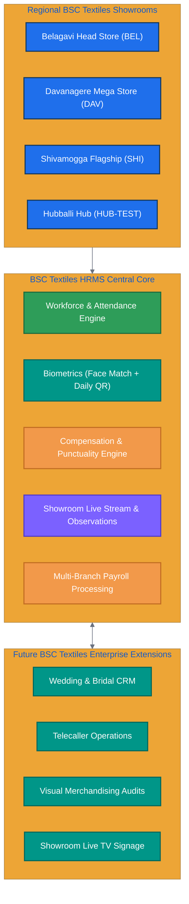

# BSC TEXTILES HRMS

## Product Requirements Document (PRD) + Complete Production Development Specification

Build a complete, production-ready **BSC Textiles HRMS – Next Generation Workforce Management System**.

This is **not a demo, prototype, UI mockup, static frontend, or partially connected application**. Build the complete working product with frontend, backend, database, authentication, authorization, APIs, realtime functionality, business logic, file handling, reporting, audit logs, testing, and deployment configuration.

The system must be designed for long-term expansion and must support multiple BSC Textiles locations without rewriting the core architecture.

---

# 1. PRODUCT NAME

**BSC Textiles HRMS**

Tagline:

**Weaving Dreams, Building Futures**

Company:

**BSC Textiles Pvt Ltd**

The interface must consistently use **BSC Textiles** branding.

---

# 2. PRIMARY OBJECTIVE

Create a centralized HRMS and workforce operations platform for BSC Textiles that manages:

* Employees
* Locations
* Floors
* Departments
* Sections
* Selling Points
* Roles
* Permissions
* Attendance
* Login/logout
* Late/early calculations
* Break management
* Lunch management
* Tea-break management
* Weekly offs
* Shift management
* Face verification
* Employee QR codes
* Daily QR validation
* QR-based break management
* Incentives
* Penalties
* Payroll integration
* Observations
* Employee performance
* Video observations
* Live streaming
* Live-stream chat
* Notifications
* Reports
* Audit logs
* Device integration
* HR management
* Real-time dashboards
* Security
* Data analytics

The architecture must allow future BSC Textiles systems such as Wedding CRM, Telecaller, customer management, store operations, feedback, VM, Live TV, and other modules to integrate without breaking the HRMS.



---

# 3. TECHNOLOGY REQUIREMENTS

## Frontend

Use:

* React.js
* TypeScript
* Modern component architecture
* Responsive design
* Desktop support
* Tablet support
* Mobile support
* PWA-ready architecture

Suggested:

* React Router
* React Query/TanStack Query
* WebSocket/Socket.IO client
* Tailwind CSS or equivalent scalable design system
* Reusable components
* Form validation
* Error boundaries
* Loading states
* Empty states
* Permission-aware UI

## Backend

Use:

* Next.js
* TypeScript
* REST APIs
* WebSocket/Socket.IO or equivalent realtime technology
* Server-side authorization
* Background jobs
* Scheduled jobs
* File/media services
* Validation
* Rate limiting
* Security middleware

## Database

Use:

* MySQL
* Prisma ORM

Database must contain proper:

* Primary keys
* Foreign keys
* Unique constraints
* Composite indexes
* Transactions
* Cascading strategy where appropriate
* Soft-delete/deactivation strategy
* Audit history

---

# 4. REQUIRED PROJECT STRUCTURE

The root project must contain only the required application structure.

```text
BSC-Textiles-HRMS/
│
├── frontend/
│
├── backend/
│
├── database/
│
├── README.md
└── .gitignore
```

Do not create unnecessary application folders at the root.

## Frontend

Organize by feature/module rather than putting everything into one large folder.

Example:

```text
frontend/
├── public/
├── src/
│   ├── app/
│   ├── components/
│   ├── layouts/
│   ├── modules/
│   │   ├── dashboard/
│   │   ├── employees/
│   │   ├── attendance/
│   │   ├── breaks/
│   │   ├── qr/
│   │   ├── face-verification/
│   │   ├── incentives/
│   │   ├── observations/
│   │   ├── live-stream/
│   │   ├── payroll/
│   │   ├── reports/
│   │   ├── locations/
│   │   ├── users/
│   │   ├── roles/
│   │   ├── notifications/
│   │   └── audit/
│   ├── services/
│   ├── hooks/
│   ├── utils/
│   ├── types/
│   └── routes/
└── package.json
```

## Backend

Organize by domain/module.

```text
backend/
├── src/
│   ├── app/
│   ├── modules/
│   │   ├── auth/
│   │   ├── users/
│   │   ├── roles/
│   │   ├── locations/
│   │   ├── employees/
│   │   ├── attendance/
│   │   ├── breaks/
│   │   ├── qr/
│   │   ├── face-verification/
│   │   ├── shifts/
│   │   ├── leave/
│   │   ├── incentives/
│   │   ├── penalties/
│   │   ├── payroll/
│   │   ├── observations/
│   │   ├── live-stream/
│   │   ├── notifications/
│   │   ├── reports/
│   │   ├── audit/
│   │   └── settings/
│   ├── middleware/
│   ├── realtime/
│   ├── jobs/
│   ├── storage/
│   ├── security/
│   ├── utils/
│   └── config/
└── package.json
```

## Database

```text
database/
├── prisma/
│   ├── schema.prisma
│   ├── migrations/
│   └── seed.ts
├── scripts/
└── package.json
```

---

# 5. USER TYPES

The system must support configurable roles.

Initial roles:

* Super Admin
* Admin
* HR Manager
* HR
* Location Manager
* Floor Manager
* Department Manager
* Team Lead
* CRM Manager
* Employee
* T-Shop Owner
* Tea Break Owner
* Attendance Operator
* Security
* Viewer
* Auditor

Do not hard-code permissions to these roles.

Admin must be able to create:

* Custom roles
* Custom permissions
* Custom access scopes

---

# 6. PERMISSION SYSTEM

Implement granular RBAC.

Permissions must support:

* View
* Add
* Edit
* Delete
* Approve
* Reject
* Assign
* Export
* Import
* Configure
* Manage
* Record
* Upload
* Publish
* Scan
* View Sensitive Data
* Manage Payroll
* Manage Incentives
* Manage Attendance
* Manage Employees
* Manage Locations
* Manage Live Stream

Permissions must be checked:

1. In frontend
2. In backend
3. At API level
4. At database/query level where applicable

Never rely only on hiding frontend buttons.

A user must not gain access by changing:

* URL
* Query parameter
* Location ID
* Employee ID
* API request body
* API endpoint
* Browser storage
* Client-side state

---

# 7. LOCATION-BASED ACCESS CONTROL

Locations must be dynamic.

Initial locations:

```text
BEL – Belagavi
DAV – Davanagere
SHI – Shivamogga
HUB-TEST – Hubballi Test
```

Admin must be able to create unlimited locations.

Location data structure:

* Location ID
* Location code
* Location name
* Address
* Phone
* Email
* Status
* Timezone
* Working hours
* Weekly-off configuration
* Settings
* Managers
* Floors

A location-based user must only see assigned location data.

Example:

A Shivamogga HR user must not see:

* Belagavi employees
* Davanagere attendance
* Belagavi payroll
* Davanagere QR scans

Even if the user manually changes API parameters.

All location security must be enforced server-side.

---

# 8. ORGANIZATION HIERARCHY

Implement:

```text
Location
   ↓
Floor
   ↓
Department
   ↓
Section
   ↓
Selling Point
   ↓
Employee
```

Each level must be independently configurable.

---

# 9. FLOOR MANAGEMENT

Admin/authorized HR can:

* Create floors
* Edit floors
* Deactivate floors
* Assign floor manager
* Assign departments
* Assign sections
* Assign selling points
* Assign employees
* Set targets
* Set incentives
* Configure working rules

Floor examples:

* Ground Floor
* First Floor
* Second Floor
* Third Floor

But the application must not hard-code these values.

---

# 10. SELLING POINT MANAGEMENT

Selling points must support:

* Name
* Code
* Location
* Floor
* Section
* Manager
* Employees
* Target
* Incentive rule
* Performance score
* Status

Examples:

* Silk Sarees
* Normal Sarees
* Ladies Wear
* Kids Wear
* Mens Wear
* Suits
* Jewellery
* Wedding
* Home Furnishing
* Billing
* Customer Service
* Reception

Admin must be able to create any new selling point.

---

# 11. EMPLOYEE MANAGEMENT

Employee profile must include:

* Employee ID
* Test-safe unique ID where applicable
* Full name
* Profile photo
* Mobile
* Email
* Gender/group where company policy requires it
* Department
* Designation
* Role
* Location
* Floor
* Section
* Selling point
* Manager
* Team lead
* Date of joining
* Employment status
* Shift
* Weekly off
* Salary information
* QR identity
* Face-verification configuration/status
* Attendance history
* Break history
* Leave history
* Incentives
* Penalties
* Observations
* Performance
* Training
* Documents
* Audit history

---

# 12. AUTHENTICATION

Implement secure authentication.

Requirements:

* Login
* Logout
* Session management
* Password hashing
* Password change
* Password reset
* Session expiration
* Device/session management
* Login history
* Failed-login tracking
* Rate limiting
* Optional OTP/MFA architecture
* Security audit logs

Never store plain-text passwords.

---

# 13. ATTENDANCE SYSTEM

Attendance must support:

* Login
* Logout
* Early login
* On-time login
* Late login
* Early logout
* Overtime
* Grace period
* Attendance correction
* Manual correction
* Face verification
* Device-based attendance
* QR-based workflows
* Weekly off
* Holiday
* Absent
* Present
* Half-day
* Leave

Attendance timestamps must support second-level precision.

Use server/database timestamps as the authoritative time.

---

# 14. LOGIN TIME CALCULATION

Example configuration:

Scheduled login:

```text
10:30 AM
```

Grace period:

```text
5 minutes
```

Grace threshold:

```text
10:35 AM
```

Before 10:35:

* On-time / early according to policy.

After 10:35:

* Late duration begins from the configured threshold.

Late calculation must be configurable.

Example policy:

```text
₹1 per second
```

The system must calculate:

```text
Late Seconds × Configured Rate = Late Penalty
```

Do not hard-code ₹1 permanently.

Admin/HR must be able to configure:

* Amount
* Currency
* Per second
* Per minute
* Per hour
* Fixed amount
* Effective date
* End date
* Approval

Any wage deduction must remain subject to company policy, authorization, payroll rules, and applicable law. The timer must not automatically deduct money solely because an event occurred.

---

# 15. EARLY LOGIN INCENTIVE

Support configurable early-login incentive.

Example:

Employee scheduled login:

```text
10:30 AM
```

Actual login:

```text
10:20 AM
```

Early duration:

```text
600 seconds
```

Configured incentive:

```text
₹1 per second
```

Calculation:

```text
600 × ₹1 = ₹600
```

The system must display the exact calculation.

Do not fabricate calculations.

---

# 16. LOGOUT/OFFTIME CALCULATION

Support:

* Early logout
* Scheduled logout
* Overtime
* Grace period
* Overtime incentive
* Early departure penalty where policy permits

Configuration must include:

* Scheduled logout
* Grace period
* Overtime start
* Rate
* Maximum cap
* Approval requirement

---

# 17. BREAK MANAGEMENT

Break types must be configurable.

Initial break types:

* Lunch
* Tea
* Other
* Custom

Default example rules:

### Lunch

Male employee group:

```text
1 hour 40 minutes
```

Female employee group:

```text
40 minutes
```

### Tea

Male employee group:

```text
20 minutes
```

Female employee group:

```text
15 minutes
```

Also support a company-wide policy such as:

```text
20 minutes for everyone
```

Do not scatter gender-specific logic throughout the source code.

Store policies in configurable database records.

Support:

* Employee group
* Location
* Department
* Floor
* Shift
* Role
* Effective date
* Maximum break duration
* Warning period
* Overage handling

Avoid making sensitive attributes mandatory unless legitimately required by the business/policy.

---

# 18. BREAK TIMER

When an employee starts a break:

Record:

* Employee
* Break type
* Start time
* Allowed duration
* Expected end time
* Actual end time
* Overtime seconds
* Location
* Floor
* Device
* Source
* Authorized user if manually entered

Realtime UI must display:

```text
BREAK
00:12:43 remaining
```

When the break expires:

* Show warning
* Update employee status
* Notify authorized manager where configured
* Record overrun
* Calculate policy-based overrun

No page refresh should be required.

---

# 19. WEEKLY OFF

Weekly off must be configurable by:

* Employee
* Department
* Location
* Floor
* Shift
* Team

Support:

* Monday
* Tuesday
* Wednesday
* Thursday
* Friday
* Saturday
* Sunday

Also support:

* Rotational weekly off
* Alternate week off
* Custom schedules
* Holidays

---

# 20. FACE VERIFICATION

Integrate a real face verification provider or modular face-verification service.

For each verification store:

* Employee
* Date
* Time
* Location
* Device
* Provider
* Match percentage/confidence returned by provider
* Threshold
* Result
* Failure reason
* Verification mode

Example:

```text
Face Match: 97.42%
Threshold: 85%
Result: VERIFIED
```

Another:

```text
Face Match: 71.20%
Threshold: 85%
Result: FAILED
```

Never fabricate or randomly generate a match percentage.

Display the actual value returned by the underlying service.

---

# 21. FACE VERIFICATION DASHBOARD

Dashboard should show:

* Total verifications
* Verified
* Failed
* Average match %
* Highest match %
* Lowest match %
* Below-threshold count
* Manual verification count
* Location-wise results
* Device-wise results
* Daily trend
* Monthly trend

Filters:

* Date
* Location
* Floor
* Department
* Employee
* Device
* Result

---

# 22. EMPLOYEE DAILY QR SYSTEM

Every employee must receive a secure daily QR token.

Requirements:

* Unique token
* Secure random generation
* One token per employee per date
* Previous day token invalid
* Token expiration
* One-time consumption
* Replay protection
* Server validation
* Active employee check

Never put sensitive employee information directly into the QR value.

QR should point to a secure token/reference.

---

# 23. QR SCANNER PERMISSIONS

QR scanning must be permission controlled.

Authorized users may include:

* T-Shop Owner
* Tea Break Owner
* Floor Manager
* HR
* Admin

Admin must decide which roles can scan which QR type.

---

# 24. QR SCAN FLOW

Flow:

```text
Scan QR
↓
Validate Token
↓
Validate Date
↓
Validate Expiration
↓
Validate Employee
↓
Validate Location
↓
Validate Scanner Permission
↓
Check Duplicate
↓
Create Transaction
↓
Show Result
```

Successful screen:

```text
Employee: TEST-EMP-001
Location: Shivamogga
Floor: First Floor

Tea Break Started
Allowed: 20 Minutes
Remaining: 19:59
```

Second attempt:

```text
This QR code has already been scanned for today.
```

Do not create duplicate transactions.

---

# 25. QR AUDIT LOG

Every QR attempt must record:

* Employee
* QR token reference
* Scanner
* Scanner role
* Location
* Purpose
* Date/time
* Device
* IP where appropriate
* Result
* Failure reason
* Transaction ID

---

# 26. QR SECURITY

Protect against:

* Replay
* Expired QR
* Wrong location
* Wrong role
* Duplicate scan
* Token guessing
* Brute force
* Tampering
* Forgery

Use cryptographically secure random tokens.

---

# 27. INCENTIVE MANAGEMENT

Admin/HR must be able to create incentives.

Types:

* Individual
* Department
* Location
* Floor
* Selling point
* Sales
* Attendance
* Early login
* Overtime
* Performance
* Target
* Custom

Calculation:

* Fixed
* Per second
* Per minute
* Per hour
* Percentage
* Target-based
* Attendance-based
* Performance-based

Fields:

* Incentive ID
* Name
* Description
* Location
* Department
* Floor
* Selling point
* Employee
* Type
* Calculation method
* Amount
* Percentage
* Target
* Effective date
* Expiry date
* Status
* Approval status
* Created by
* Approved by

---

# 28. INCENTIVE CALCULATION TRANSPARENCY

Every calculation must be explainable.

Example:

```text
Early Login
600 seconds × ₹1.00
= ₹600.00
```

The user must be able to inspect the calculation source.

Do not hide calculations behind unexplained totals.

---

# 29. PENALTY / DEDUCTION MANAGEMENT

Support configurable penalties.

Examples:

* Late arrival
* Break overrun
* Early logout

Requirements:

* Configurable rule
* Approval workflow
* Effective date
* Maximum limit
* Reason
* Audit trail
* Payroll integration

Do not automatically turn every timing event into a wage deduction.

---

# 30. PAYROLL INTEGRATION

Payroll must support:

* Basic salary
* Allowances
* Incentives
* Approved deductions
* Attendance adjustments
* Overtime
* Leave impact
* Payroll period
* Gross salary
* Net salary
* Approval
* Payroll lock
* Payslip generation

Every payroll value must be traceable.

---

# 31. OBSERVATION MODULE

HR/Managers must be able to create observations.

Fields:

* Observation ID
* Location
* Floor
* Department
* Section
* Selling point
* Employee
* Type
* Priority
* Rating
* Description
* Action required
* Assigned person
* Due date
* Status
* Attachment
* Video
* Photo
* Voice note where supported
* Created by
* Created time
* Updated by
* Updated time

Observation types:

* Customer service
* Sales
* Attendance
* Discipline
* Grooming
* Behaviour
* Product knowledge
* Selling skill
* Store standards
* VM
* Safety
* Break monitoring
* Positive performance
* Improvement required
* Other

---

# 32. OBSERVATION LEVELS

Support:

* Excellent
* Very Good
* Good
* Needs Improvement
* Critical

Admin must be able to create custom levels and numeric scores.

---

# 33. OBSERVATION REACTIONS

Support:

* Acknowledged
* Positive
* Completed
* Reviewing
* Needs Attention
* Rejected
* Excellent

Also support emoji reactions where appropriate:

```text
👍 ❤️ ✅ 👀 ⚠️
```

Store reactions in database.

---

# 34. OBSERVATION CHAT

Each observation can contain chat.

Support:

* Messages
* Replies
* Mentions
* Reactions
* Attachments
* Timestamps
* Edited messages
* Deleted messages
* Moderation
* Audit logging

Messages must persist in MySQL.

Realtime updates should use WebSockets.

---

# 35. VIDEO OBSERVATIONS

Support:

* Browser camera
* Video upload
* Video title
* Description
* Employee
* Location
* Floor
* Section
* Selling point
* Observation
* Date/time
* Created by

Store media securely.

Do not put very large video binary data directly into normal relational rows unless there is a strong technical reason.

Use object/file storage architecture.

---

# 36. LIVE STREAMING

Create a genuine live-stream module.

Support:

* Start
* Stop
* Pause
* Resume
* Viewer count
* Host
* Location
* Floor
* Section
* Selling point
* Title
* Description
* Start time
* End time
* Status

Support a real streaming technology such as:

* WebRTC
* RTMP
* HLS
* Appropriate streaming infrastructure

Do not simulate live streaming by looping an uploaded video.

---

# 37. LIVE STREAM CHAT

Support:

* Text messages
* Reactions
* Mentions
* System messages
* Moderation
* Delete
* Pin
* Mute
* Viewer permissions
* Timestamps

All messages must be stored.

---

# 38. LIVE STREAM OBSERVATIONS

Authorized viewers can create observations during live streams.

Save:

* Stream ID
* Timestamp
* Employee
* Location
* Floor
* Selling point
* Observation
* User
* Date/time

Clicking the observation should be able to navigate to the relevant timestamp when the stream/video technology supports seeking.

---

# 39. REALTIME DASHBOARD

No repeated manual page refresh.

Realtime updates should support:

* Attendance counters
* Employee presence
* Break status
* QR scans
* Notifications
* Live stream status
* Viewer counts
* Chat
* Reactions
* Observations
* Incentive updates
* Important alerts

Use WebSocket/Socket.IO or equivalent.

Handle connection loss gracefully.

Do not repeatedly display:

```text
Please refresh the page
```

Instead:

* Automatically reconnect
* Show subtle connection status
* Retry requests
* Recover subscriptions
* Refresh affected data selectively

---

# 40. DASHBOARD

Dashboard must be dynamic and database driven.

Cards:

* Total Employees
* Present
* Absent
* Late
* Early Login
* Overtime
* Lunch
* Tea Break
* Weekly Off
* Face Verified
* Face Failed
* Average Face Match %
* QR Scans
* QR Failures
* Incentives
* Penalties
* Observations
* Live Streams
* Active Selling Points

All numbers must come from actual database queries.

No hard-coded values.

---

# 41. HR DASHBOARD

Provide:

* Daily workforce summary
* Attendance trends
* Break status
* Late employees
* Early employees
* Overtime
* Weekly off
* Face verification
* QR activity
* Observations
* Incentives
* Payroll status
* Employee alerts
* Location comparison

---

# 42. FLOOR MANAGER DASHBOARD

Display:

* Employees on floor
* Present
* Absent
* Late
* Lunch
* Tea
* Weekly off
* Current selling point
* Selling point status
* Pending observations
* Employee performance
* Alerts

Only show employees permitted by location/floor scope.

---

# 43. EMPLOYEE DASHBOARD

Employee sees only their permitted personal information.

Show:

* Attendance
* Login
* Logout
* Breaks
* Lunch
* Tea
* Weekly off
* Shift
* Incentives
* Approved payroll information
* Observations visible to employee
* Performance
* Notifications
* QR identity
* Face verification status

---

# 44. CAMERA / SCAN VIEW

Create a dedicated browser scan interface.

Capabilities:

* QR scanner
* Camera permissions
* Employee QR
* Selling point QR
* Location QR
* Attendance verification
* Break scanning
* Observation attachment

Never automatically open the camera without user action.

If permission is denied:

* Explain why
* Provide retry
* Provide supported fallback

---

# 45. DEVICE INTEGRATION

Create an abstraction layer for hardware.

Support future integration with:

* Attendance machines
* Biometric devices
* Face devices
* QR scanners
* Smart terminals

Never tightly couple device-specific code to the attendance business logic.

---

# 46. NOTIFICATION SYSTEM

Support:

* In-app notifications
* Browser notifications
* Audio alerts where enabled
* Email notifications
* WhatsApp/SMS integration architecture
* Critical alerts

Notification types:

* Late employee
* Break expired
* QR failure
* Face verification failure
* Critical observation
* Payroll approval
* Incentive approval
* System alert
* Security alert

Notifications must be persisted.

---

# 47. AUDIT LOGGING

Audit every sensitive action.

Examples:

* Login
* Logout
* Password change
* Employee creation
* Employee update
* Employee deletion/deactivation
* Attendance correction
* QR scan
* Face verification
* Incentive creation
* Penalty creation
* Payroll changes
* Permission changes
* Role changes
* Location changes
* Observation changes
* Live stream actions

Audit record:

* User
* Action
* Module
* Record
* Old value
* New value
* IP
* Device
* Timestamp
* Result

---

# 48. REPORTING SYSTEM

Create reports for:

### Attendance

* Daily
* Monthly
* Late
* Early
* Overtime
* Absent
* Weekly off
* Leave
* Break

### Face Verification

* Verified
* Failed
* Average match
* Below threshold

### QR

* Successful
* Failed
* Duplicate
* Expired
* Wrong location
* Unauthorized

### Incentives

* Employee
* Department
* Floor
* Selling point
* Location

### Payroll

* Gross
* Incentives
* Deductions
* Net salary

### Observations

* Employee
* Location
* Department
* Selling point
* Severity
* Status

### Live Operations

* Streams
* Viewers
* Chat
* Observations

Exports:

* Excel
* CSV
* PDF
* Print

---

# 49. REPORT FILTERING

Support filters:

* Date
* Date range
* Location
* Floor
* Department
* Section
* Selling point
* Shift
* Employee
* Role
* Status

Filters must respect authorization.

---

# 50. DATA MODEL

The Prisma schema must cover all required entities, including at minimum:

```text
User
Role
Permission
RolePermission
UserRole
Location
Floor
Department
Section
SellingPoint
Employee
EmployeeGroup
Shift
Attendance
AttendanceEvent
AttendanceRule
BreakType
BreakRule
EmployeeBreak
WeeklyOffRule
Holiday
Leave
QRCode
QRCodeScan
FaceVerification
FaceVerificationSetting
IncentiveRule
EmployeeIncentive
IncentiveTransaction
PenaltyRule
PenaltyTransaction
Payroll
PayrollItem
Observation
ObservationLevel
ObservationReaction
ObservationComment
ObservationAttachment
VideoNote
LiveStream
LiveStreamViewer
LiveStreamMessage
LiveStreamReaction
StreamObservation
Notification
AuditLog
Device
DeviceEvent
Document
Training
Performance
```

Use normalized relations.

Add indexes for frequently filtered fields.

---

# 51. TRANSACTION SAFETY

Use database transactions for critical operations.

Examples:

QR scan:

```text
Validate QR
+
Create scan
+
Create break transaction
+
Create audit
```

These must succeed or fail atomically.

Avoid duplicate transactions.

---

# 52. PERFORMANCE

The application must be designed for large data volumes.

Support:

* Pagination
* Cursor pagination where appropriate
* Server-side filtering
* Database indexes
* Query optimization
* Caching
* Background jobs
* Lazy loading
* Virtualized lists where necessary
* Efficient realtime subscriptions

Never load all employees/attendance records unnecessarily.

---

# 53. API DESIGN

Use clean REST API conventions.

Example:

```text
/api/auth/*
/api/users/*
/api/roles/*
/api/locations/*
/api/floors/*
/api/departments/*
/api/employees/*
/api/attendance/*
/api/breaks/*
/api/qr/*
/api/face-verification/*
/api/incentives/*
/api/payroll/*
/api/observations/*
/api/live-stream/*
/api/reports/*
/api/notifications/*
/api/audit/*
```

API responses must use consistent structure.

Example:

```json
{
  "success": true,
  "data": {},
  "message": "Operation successful"
}
```

Error:

```json
{
  "success": false,
  "error": {
    "code": "UNAUTHORIZED",
    "message": "You do not have permission to access this resource."
  }
}
```

Do not expose stack traces to normal users.

---

# 54. ERROR HANDLING

The system must never crash because of an ordinary API failure.

Handle:

* Network failures
* Database failures
* Timeout
* Session expiry
* WebSocket disconnect
* Invalid data
* Unauthorized access
* Duplicate operation
* Device failure
* Camera permission failure
* File upload failure

Display clear user-friendly messages.

Do not repeatedly tell users to manually refresh.

---

# 55. DATA VALIDATION

Use strong validation.

Validate:

* Mobile
* Email
* Date
* Time
* Employee ID
* Location
* IDs
* Numeric values
* Salary
* Incentive rates
* File size
* File types
* QR tokens
* API payloads

Protect against:

* SQL injection
* XSS
* CSRF where applicable
* Command injection
* Path traversal
* Malicious uploads

---

# 56. FILE STORAGE

Media must support:

* Employee photos
* Documents
* Observation images
* Observation videos
* Live-stream metadata
* Attachments

Storage architecture must support local development and cloud deployment.

Do not rely exclusively on local filesystem storage for production.

---

# 57. SECURITY

Implement:

* HTTPS-ready configuration
* Secure cookies
* Session protection
* Password hashing
* Input sanitization
* RBAC
* Location-based authorization
* API rate limiting
* Login rate limiting
* Audit logging
* File validation
* QR security
* Token rotation
* Encryption where appropriate
* Secrets through environment variables

Never commit API keys or passwords.

---

# 58. ENVIRONMENT VARIABLES

Provide `.env.example`.

Include placeholders for:

```text
DATABASE_URL
AUTH_SECRET
NEXT_PUBLIC_APP_URL
API_URL
WEBSOCKET_URL
STORAGE_PROVIDER
STORAGE_BUCKET
STORAGE_ACCESS_KEY
STORAGE_SECRET_KEY
FACE_API_URL
FACE_API_KEY
EMAIL_HOST
EMAIL_USER
EMAIL_PASSWORD
WHATSAPP_API_URL
WHATSAPP_ACCESS_TOKEN
WHATSAPP_PHONE_NUMBER_ID
SMS_PROVIDER
SMTP configuration
```

Never hard-code credentials.

---

# 59. TEST DATA

Seed only synthetic data.

Every test record must clearly indicate:

```text
TEST-
```

Examples:

```text
TEST-EMP-001
TEST-EMP-002
TEST-LOC-BEL
TEST-OBS-001
TEST-QR-001
```

Do not use real customer/employee PII.

Seed:

* 4 test locations
* 30–50 employees
* Multiple departments
* Multiple floors
* Multiple selling points
* Multiple roles
* 30 days attendance
* Leave
* Holidays
* Break data
* Weekly offs
* QR scans
* Duplicate QR attempts
* Expired QR attempts
* Face verification scores
* Incentives
* Penalties
* Payroll
* Observations
* Reactions
* Chat
* Video metadata
* Live streams
* Notifications
* Audit records

---

# 60. AUTOMATED TESTING

Create automated tests for:

### Attendance

* On-time
* Early
* Grace-period
* Late
* Overtime
* Early logout

### Breaks

* Correct duration
* Expired break
* Break overrun
* Different rules

### QR

* Valid QR
* Expired QR
* Previous-day QR
* Duplicate QR
* Wrong role
* Wrong location
* Invalid token
* Replay attempt

### Face

* Above threshold
* Below threshold
* Exact threshold

### Permissions

* Admin access
* HR access
* Location restriction
* Floor restriction
* Unauthorized request

### Incentives

* Per-second
* Per-minute
* Fixed
* Percentage
* Target

### Security

* Authentication
* Authorization
* Rate limiting
* Input validation

---

# 61. UI/UX REQUIREMENTS

The application must look like a professional enterprise product.

Do not produce:

* Generic template UI
* Empty dashboards
* Fake charts
* Placeholder buttons
* Broken navigation
* Inconsistent spacing
* Random colors
* Unfinished screens

Use:

* Professional typography
* Consistent spacing
* Reusable components
* Responsive tables
* Clear cards
* Useful charts
* Status indicators
* Professional modals
* Confirmation dialogs
* Toast notifications
* Skeleton loaders
* Empty states
* Error states

---

# 62. REALTIME DESIGN

Use realtime events such as:

```text
attendance.updated
break.started
break.ended
break.expired
qr.scanned
face.verified
employee.status.changed
observation.created
observation.updated
observation.reaction
chat.message
live.stream.started
live.stream.stopped
live.stream.viewer
notification.created
```

Events must be authenticated and permission-aware.

A user must receive only events permitted by their scope.

---

# 63. KEY END-TO-END WORKFLOWS

## Employee attendance

```text
Employee
↓
Face / Device Verification
↓
Match Validation
↓
Attendance Record
↓
Early/Late Calculation
↓
Realtime Status
↓
Notification
↓
Payroll/Incentive Calculation
↓
Audit Log
```

## Tea break

```text
Employee
↓
Daily QR
↓
Authorized Scanner
↓
QR Validation
↓
Employee Validation
↓
Break Rule Lookup
↓
Break Start
↓
Realtime Timer
↓
Break End
↓
Overrun Calculation
↓
Audit Log
```

## Observation

```text
Manager
↓
Select Employee
↓
Create Observation
↓
Attach Image/Video
↓
Assign Action
↓
Notify Employee/Manager
↓
Chat/Reactions
↓
Resolution
↓
Audit
```

## Live observation

```text
Host
↓
Start Live Stream
↓
Viewer Joins
↓
Real-time Video
↓
Chat
↓
Timestamped Observation
↓
Employee Association
↓
Follow-up Action
```

---

# 64. LEGACY BSC SYSTEM INTEGRATION

Do not break existing BSC Textiles functionality.

Architecture must remain compatible with existing:

* Wedding CRM
* Wedding registration
* Telecaller
* Customer management
* Feedback
* VM
* Live TV
* Store operations
* Notifications
* User management
* Location management

Use modular architecture so additional modules can be added independently.

Example future module:

```text
backend/src/modules/whatsapp-crm/
frontend/src/modules/whatsapp-crm/
```

Do not create monolithic files.

---

# 65. ADMIN CONTROL CENTER

Admin must have complete configuration screens for:

* Locations
* Floors
* Departments
* Sections
* Selling points
* Employees
* Roles
* Permissions
* Shifts
* Attendance rules
* Break rules
* Weekly offs
* Incentives
* Penalties
* Payroll rules
* Face thresholds
* QR settings
* Notification rules
* Device settings
* Live streaming
* Storage
* Security
* System settings

Changes must be audited.

---

# 66. ARCHIVING / DELETION

Do not permanently delete important business history by default.

Use:

* Active
* Inactive
* Archived

Where physical deletion is necessary, protect referential integrity and require appropriate permission.

Historical attendance/payroll/audit records must remain traceable.

---

# 67. BACKUP & RECOVERY

Provide architecture/configuration for:

* MySQL backups
* Database restore
* Media backup
* Audit preservation
* Disaster recovery

Document backup procedures in README.

---

# 68. OBSERVABILITY

Production system should support:

* Structured logging
* Error logging
* API request logging
* Security event logging
* Performance metrics
* Realtime connection monitoring
* Database health monitoring

Never expose sensitive secrets in logs.

---

# 69. DEPLOYMENT

The system must be production deployable.

Provide:

* Development configuration
* Staging configuration
* Production configuration
* Environment examples
* Database migration process
* Seed process
* Build commands
* Start commands
* Backup instructions

Do not create deployment configuration that depends on undocumented local paths.

---

# 70. DOCUMENTATION

Provide a complete README including:

* System architecture
* Installation
* Requirements
* Environment variables
* Database setup
* Prisma setup
* Migration
* Seed
* Development
* Production build
* API overview
* Authentication
* Permissions
* Location security
* QR flow
* Face verification
* Realtime system
* Live streaming
* File storage
* Testing
* Backup
* Deployment
* Troubleshooting

---

# 71. DEFINITION OF DONE

The project is considered complete only when:

* Frontend works
* Backend works
* Database works
* Prisma migrations work
* Seed works
* Authentication works
* RBAC works
* Location restrictions work
* Employee module works
* Attendance works
* Breaks work
* Weekly offs work
* QR works
* Daily QR expiration works
* Duplicate QR protection works
* Face verification integration architecture works
* Match percentage displays correctly
* Incentives work
* Penalties work
* Payroll integration works
* Observations work
* Chat works
* Video observations work
* Live streaming architecture works
* Notifications work
* Reports work
* Audit logs work
* Realtime updates work
* API error handling works
* Automated tests pass
* No critical console errors
* No broken routes
* No fake data in production mode
* No hard-coded dashboard numbers
* No unauthorized location data exposure
* No security-critical warnings

---

# 72. CRITICAL DEVELOPMENT RULE

Do not create a “looks complete” application.

Every button that claims to perform an action must actually perform that action.

Every displayed number must come from real data.

Every form must save to the database.

Every API must be connected to the frontend.

Every permission must be enforced on the backend.

Every location restriction must be enforced on the backend.

Every important operation must be audited.

Every realtime feature must recover from temporary connection failures.

No placeholder implementation should remain in production functionality.

---

# 73. FINAL QUALITY REQUIREMENT

Before declaring the project complete, perform a complete end-to-end validation of the application.

Verify:

```text
Frontend
↓
API
↓
Authentication
↓
Authorization
↓
Business Logic
↓
Database
↓
Realtime Events
↓
Notifications
↓
Audit
↓
Reports
```

Verify each module individually and together.

Test:

* Admin
* HR
* Floor Manager
* Employee
* T-Shop Owner
* Location-restricted user
* Unauthorized user

Test multiple locations:

```text
Belagavi
Davanagere
Shivamogga
Hubballi Test
```

Confirm that each user can see only the data allowed by their role and location.

The final result must be a **production-grade BSC Textiles HRMS platform**, designed for real enterprise deployment, future expansion, high data volume, strong security, realtime operations, and modular integration with the wider BSC Textiles ecosystem.
