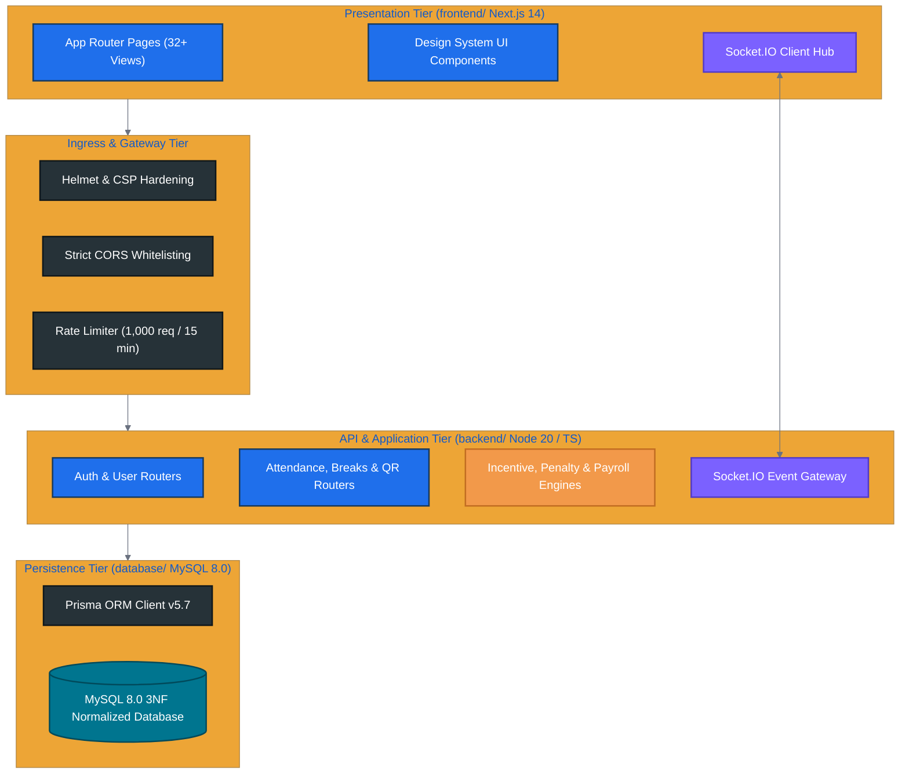
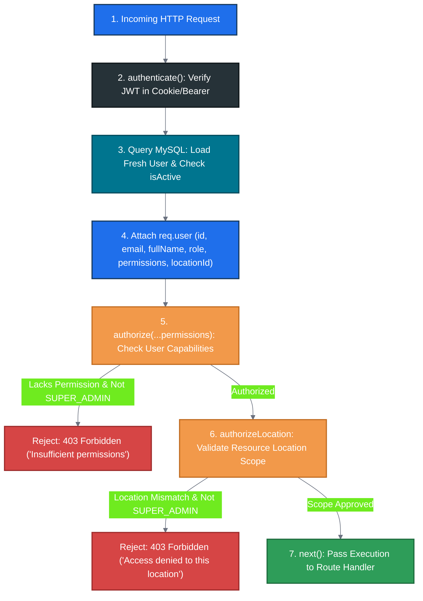

# BSC TEXTILES HRMS

## TECHNICAL REQUIREMENTS DOCUMENT (TRD)

**Product:** BSC Textiles HRMS – Next Generation Workforce Management System
**Company:** BSC Textiles Pvt Ltd
**Document Type:** Technical Requirements Document
**Version:** 1.0
**Status:** Production Technical Specification
**Architecture:** React.js + TypeScript + Next.js + MySQL + Prisma
**Primary Timezone:** Asia/Kolkata
**Primary Locations:** Belagavi (BEL), Davanagere (DAV), Shivamogga (SHI)

---

# 1. DOCUMENT PURPOSE

This document defines the complete technical requirements for designing, developing, testing, deploying, securing, maintaining, and scaling the BSC Textiles HRMS.

This document must be treated as the technical source of truth for implementation.

The system must be:

* Production-ready
* Modular
* Secure
* Scalable
* Maintainable
* Observable
* Testable
* Realtime capable
* Multi-location
* Permission-driven
* Database-backed
* API-driven
* Deployment-ready

The implementation must not be a prototype, mockup, static UI, or demonstration system.

---

# 2. SYSTEM OBJECTIVE

Build an enterprise HRMS and workforce operations platform that provides centralized management of:

* Employees
* Users
* Roles
* Permissions
* Locations
* Floors
* Departments
* Sections
* Selling points
* Shifts
* Attendance
* Breaks
* Weekly offs
* Leave
* Face verification
* Daily QR identity
* QR scanning
* Incentives
* Penalties
* Payroll integration
* Observations
* Video observations
* Live streaming
* Live chat
* Notifications
* Reports
* Audit logs
* Device integration
* Realtime operations

The architecture must support future BSC Textiles modules without requiring a rewrite of the core system.

---

# 3. TECHNICAL DESIGN PRINCIPLES

The implementation must follow these principles:

## 3.1 Modularity

Each business domain must be independently organized.

## 3.2 Separation of Concerns

Separate:

* UI
* API
* Controllers/route handlers
* Services
* Business rules
* Data access
* Realtime
* Background jobs
* Security
* Storage
* Reporting

## 3.3 Server-Side Security

Never trust client-side permission checks.

All authorization must be validated by the backend.

## 3.4 Database as Source of Truth

Important business records must be persisted in MySQL.

Do not use:

* Browser localStorage as the primary database
* Temporary arrays
* Fake JSON data
* Hard-coded dashboard counters

## 3.5 Transaction Safety

Critical multi-record operations must be atomic.

## 3.6 Auditable Operations

Security-sensitive and business-critical modifications must be traceable.

## 3.7 Realtime First Where Appropriate

Use realtime events for operational information that benefits from immediate updates.

## 3.8 Configuration Over Hard-Coding

Business rules such as:

* Break duration
* Grace period
* Incentive rate
* Face threshold
* Weekly off
* Shift timings

must be configurable.

---

# 4. REQUIRED PROJECT ARCHITECTURE

Project root:

```text
BSC-Textiles-HRMS/
├── frontend/
├── backend/
├── database/
├── README.md
└── .gitignore
```



No unnecessary application folders should be added to the root.

---

# 5. FRONTEND TECHNICAL REQUIREMENTS

Frontend must use:

* React.js
* TypeScript
* Responsive design
* Component-based architecture
* Feature/module-based organization
* API client abstraction
* Centralized state where required
* Server-state/data-fetching abstraction
* Form validation
* Error boundaries
* Permission-aware UI
* Realtime client
* Camera/QR functionality
* Responsive tables
* Charts
* Notifications
* Accessible interaction patterns

Recommended architecture:

```text
frontend/
└── src/
    ├── app/
    ├── components/
    ├── layouts/
    ├── modules/
    ├── services/
    ├── hooks/
    ├── utils/
    ├── types/
    ├── routes/
    └── config/
```

Each module should contain its own:

* Screens
* Components
* API calls
* Types
* Hooks
* Validation
* Utilities

where appropriate.

---

# 6. BACKEND TECHNICAL REQUIREMENTS

Backend must use:

* Next.js
* TypeScript
* REST APIs
* Server-side authorization
* Prisma
* MySQL
* Realtime services
* Background jobs
* Centralized validation
* Security middleware
* Structured logging

Recommended domain structure:

```text
backend/
└── src/
    ├── modules/
    │   ├── auth/
    │   ├── users/
    │   ├── roles/
    │   ├── permissions/
    │   ├── locations/
    │   ├── floors/
    │   ├── departments/
    │   ├── sections/
    │   ├── selling-points/
    │   ├── employees/
    │   ├── attendance/
    │   ├── breaks/
    │   ├── shifts/
    │   ├── leave/
    │   ├── qr/
    │   ├── face-verification/
    │   ├── incentives/
    │   ├── penalties/
    │   ├── payroll/
    │   ├── observations/
    │   ├── live-stream/
    │   ├── notifications/
    │   ├── reports/
    │   ├── audit/
    │   └── settings/
    ├── middleware/
    ├── realtime/
    ├── jobs/
    ├── security/
    ├── storage/
    ├── utils/
    └── config/
```

---

# 7. DATABASE TECHNICAL REQUIREMENTS

Database:

**MySQL**

ORM:

**Prisma**

Database design must contain:

* Primary keys
* Foreign keys
* Unique constraints
* Composite unique constraints where required
* Appropriate indexes
* Referential integrity
* Transaction support
* Timestamps
* Status/lifecycle fields
* Soft-deactivation where appropriate

Database schema must be normalized appropriately while avoiding unnecessary complexity.

---

# 8. DATABASE DIRECTORY

```text
database/
└── prisma/
    ├── schema.prisma
    ├── migrations/
    └── seed.ts
```

Database scripts should remain inside the database layer.

---

# 9. CORE DATA MODEL REQUIREMENTS

The schema must support at least:

```text
User
Role
Permission
RolePermission
UserRole
Session
Location
Floor
Department
Section
SellingPoint
Employee
EmployeeGroup
Shift
Attendance
AttendanceEvent
AttendanceRule
BreakType
BreakRule
EmployeeBreak
WeeklyOffRule
Holiday
Leave
QRCode
QRCodeScan
FaceVerification
FaceVerificationSetting
IncentiveRule
EmployeeIncentive
IncentiveTransaction
PenaltyRule
PenaltyTransaction
Payroll
PayrollItem
Observation
ObservationLevel
ObservationReaction
ObservationComment
ObservationAttachment
VideoNote
LiveStream
LiveStreamViewer
LiveStreamMessage
LiveStreamReaction
StreamObservation
Notification
AuditLog
Device
DeviceEvent
Document
Training
Performance
```

Additional tables may be added when technically required.

---

# 10. ID REQUIREMENTS

Use stable internal IDs.

Business identifiers such as:

```text
Employee Code
Location Code
Observation ID
Payroll ID
QR Reference
```

must be unique.

Do not expose database implementation details unnecessarily to clients.

---

# 11. TIMESTAMP REQUIREMENTS

All important records must include appropriate timestamps such as:

* createdAt
* updatedAt
* startedAt
* endedAt
* verifiedAt
* approvedAt
* cancelledAt
* archivedAt

Store authoritative event time server-side.

Application timezone:

```text
Asia/Kolkata
```

The design should remain timezone-safe for future expansion.

---

# 12. AUTHENTICATION REQUIREMENTS

Implement:

* Login
* Logout
* Session management
* Password hashing
* Password change
* Password reset
* Session expiration
* Session revocation
* Failed-login tracking
* Rate limiting

Passwords must never be stored in plaintext.

Use modern password hashing.

---

# 13. SESSION REQUIREMENTS

Session records should support:

* User
* Session ID
* Created time
* Last activity
* Expiration
* Device
* IP where appropriate
* Revoked status

Password changes should invalidate affected sessions according to security policy.

---

# 14. RBAC REQUIREMENTS

Implement role-based access control.

Role must not be equivalent to hard-coded application logic.

Support:

```text
VIEW
ADD
EDIT
DELETE
APPROVE
REJECT
ASSIGN
EXPORT
IMPORT
CONFIGURE
MANAGE
RECORD
UPLOAD
PUBLISH
SCAN
VIEW_SENSITIVE_DATA
```

Additional permissions may be added.

---

# 15. LOCATION-BASED AUTHORIZATION

Every location-sensitive request must be authorized server-side.

Security scope can include:

```text
Location
Floor
Department
Section
Selling Point
Employee
```

Example:

```text
User → SHI
Request → BEL employee
Result → 403 Forbidden
```

Changing IDs in URLs, query parameters, or JSON must not bypass this control.

---

# 16. AUTHORIZATION IMPLEMENTATION

Authorization is implemented as reusable Express middleware (`authenticate`, `authorize`, `authorizeLocation`):



Avoid duplicating authorization code across hundreds of endpoints.

---

# 17. API ARCHITECTURE

REST APIs must follow predictable conventions.

Example:

```text
/api/auth
/api/users
/api/roles
/api/permissions
/api/locations
/api/floors
/api/departments
/api/sections
/api/selling-points
/api/employees
/api/attendance
/api/breaks
/api/shifts
/api/leave
/api/qr
/api/face-verification
/api/incentives
/api/penalties
/api/payroll
/api/observations
/api/live-stream
/api/notifications
/api/reports
/api/audit
```

Actual route naming may follow the existing project's architecture, but naming must remain consistent.

---

# 18. API RESPONSE STANDARD

Successful response:

```json
{
  "success": true,
  "data": {},
  "message": "Operation successful"
}
```

Error response:

```json
{
  "success": false,
  "error": {
    "code": "FORBIDDEN",
    "message": "You do not have permission to access this resource."
  }
}
```

Do not expose:

* Stack traces
* Database internals
* Secrets
* Internal credentials

to end users.

---

# 19. API VALIDATION

All API inputs must be validated server-side.

Validate:

* Required fields
* Types
* Length
* Range
* Date
* Time
* Relationships
* IDs
* Files
* Permissions
* Business rules

Use a centralized schema-validation strategy.

---

# 20. HTTP STATUS REQUIREMENTS

Use appropriate status codes:

```text
200 OK
201 Created
204 No Content
400 Bad Request
401 Unauthorized
403 Forbidden
404 Not Found
409 Conflict
422 Unprocessable Entity
429 Too Many Requests
500 Internal Server Error
503 Service Unavailable
```

---

# 21. ATTENDANCE ENGINE

Attendance must be implemented as a dedicated business domain.

It must support:

* Login
* Logout
* Early login
* On-time
* Grace period
* Late
* Early logout
* Overtime
* Absent
* Half-day
* Leave
* Weekly off
* Holiday
* Manual correction

Attendance calculations must be server-side.

---

# 22. ATTENDANCE TIME ENGINE

Example:

```text
Scheduled = 10:30:00
Grace = 00:05:00
Threshold = 10:35:00
```

If actual login is:

```text
10:29:00 → early
10:34:59 → within grace
10:35:00 → threshold
10:35:01 → late
```

The exact business interpretation must be controlled by configuration.

---

# 23. EARLY-LOGIN INCENTIVE ENGINE

Support configurable calculation:

```text
earlySeconds × configuredRate
```

Example:

```text
600 seconds × ₹1.00
= ₹600.00
```

The engine must store the rule used to calculate the transaction.

Do not rely on a current rule to reinterpret historical records.

Historical transactions must preserve the applied rate/rule snapshot where required.

---

# 24. LATE ENGINE

Support:

```text
lateSeconds
lateRate
calculation
approval
payroll impact
```

Example:

```text
Threshold: 10:35
Actual: 10:42
Late: 420 seconds
```

Any financial deduction must be controlled by approved configuration and applicable company/legal policy.

The technical system must not treat every timing event as an automatic salary deduction.

---

# 25. OVERTIME ENGINE

Support:

* Scheduled logout
* Grace period
* Overtime start
* Overtime seconds
* Rate
* Cap
* Approval
* Payroll integration

Store calculation details.

---

# 26. BREAK RULE ENGINE

Break rules must be data-driven.

Rules may be scoped by:

* Employee group
* Location
* Department
* Floor
* Shift
* Role
* Effective dates

Example configurable values:

```text
Lunch: 100 minutes
Lunch: 40 minutes
Tea: 20 minutes
Tea: 15 minutes
```

Do not hard-code gender rules in source code.

Where group-specific policy exists, represent it as an explicit configuration model.

---

# 27. BREAK TIMER ENGINE

Store:

* Start
* Allowed duration
* Expected end
* Actual end
* Elapsed seconds
* Remaining seconds
* Overrun seconds

Client-side timer is for presentation.

The server must remain the authoritative source for event timestamps and final calculations.

---

# 28. BREAK OVER-RUN ENGINE

When a break exceeds its permitted duration:

```text
breakOverrunSeconds = actualEnd - allowedEnd
```

Create a corresponding business event.

Trigger configured alerts.

Do not create duplicate overrun records when realtime reconnects or requests are retried.

---

# 29. WEEKLY-OFF ENGINE

Support:

* Fixed weekly off
* Rotational weekly off
* Alternate weekly off
* Custom date schedules

Weekly-off assignment may be scoped to:

* Employee
* Team
* Shift
* Department
* Floor
* Location

---

# 30. LEAVE ENGINE

Support:

* Leave types
* Leave balance
* Leave application
* Approval
* Rejection
* Cancellation
* Leave history

Approved leave must integrate with attendance.

---

# 31. SHIFT ENGINE

Shift must support:

* Start time
* End time
* Grace period
* Break rules
* Overtime
* Weekly off
* Status
* Effective dates

Historical attendance must preserve the applicable configuration.

---

# 32. QR SYSTEM REQUIREMENTS

The application must generate secure daily QR identities.

Requirements:

* Cryptographically secure token
* Daily uniqueness
* Employee relationship
* Expiration
* One-time consumption where configured
* Replay prevention
* Secure validation

Do not embed sensitive personal data in the QR payload.

---

# 33. DAILY QR LIFECYCLE

```text
Generate
↓
Activate
↓
Scan
↓
Consume
↓
Invalidate
```

Previous-day tokens must not be valid for current-day transactions.

---

# 34. QR SCAN VALIDATION ORDER

Use server-side validation approximately in this order:

```text
Token format
↓
Token existence
↓
Token expiration
↓
Date validity
↓
Employee status
↓
Scanner authentication
↓
Scanner permission
↓
Location scope
↓
Duplicate/consumed status
↓
Business rule
↓
Transaction
```

---

# 35. QR IDEMPOTENCY

A repeated request for the same transaction must not create duplicate records.

Use:

* Unique constraints
* Idempotency keys where appropriate
* Transaction locking/atomic update patterns

This is mandatory for QR scanning.

---

# 36. FACE VERIFICATION

Integrate face verification through an abstraction layer.

The abstraction must allow changing provider later without rewriting attendance logic.

Record:

* Provider
* Score
* Threshold
* Result
* Employee
* Device
* Location
* Time
* Failure reason

---

# 37. FACE SCORE REQUIREMENT

If provider returns:

```text
97.42
```

display:

```text
97.42%
```

only where the provider's score semantics support percentage presentation.

Never invent a score.

Do not claim guaranteed accuracy.

---

# 38. FACE VERIFICATION THRESHOLD

Threshold must be configurable.

Example:

```text
Score = 97.42
Threshold = 85
Result = VERIFIED
```

If:

```text
Score = 71.20
Threshold = 85
Result = FAILED
```

The comparison logic must live in the backend.

---

# 39. INCENTIVE ENGINE TECHNICAL REQUIREMENTS

Support:

* Fixed
* Per second
* Per minute
* Per hour
* Percentage
* Target based
* Attendance based
* Performance based

Rule scope:

* Employee
* Department
* Floor
* Selling point
* Location
* Team

---

# 40. INCENTIVE VERSIONING

When a rule changes, existing historical transactions must retain the calculation context used when generated.

Do not retroactively recalculate historical incentive records using a new rate unless an authorized recalculation process exists.

---

# 41. PENALTY ENGINE

Support configurable penalties.

All penalty records must include:

* Rule
* Calculation
* Reason
* Scope
* Approval
* Payroll linkage
* Audit

---

# 42. PAYROLL TECHNICAL REQUIREMENTS

Payroll must aggregate approved source transactions.

Inputs may include:

* Salary
* Attendance
* Leave
* Overtime
* Approved incentives
* Approved deductions

Payroll must support:

* Draft
* Review
* Approval
* Locked
* Adjustment

---

# 43. PAYROLL LOCKING

Once payroll is locked:

* Normal users cannot modify it.
* Changes require explicit authorized adjustment workflow.
* Adjustments must be audited.

---

# 44. OBSERVATION ENGINE

Observation service must support:

* Create
* Update
* Assign
* Acknowledge
* Comment
* React
* Attach media
* Resolve
* Close

Observation data must be linked to the applicable organizational context.

---

# 45. OBSERVATION MEDIA

Media references should contain:

* Storage key/reference
* File name
* MIME type
* Size
* Uploaded by
* Created timestamp
* Associated entity

Do not store large media blobs in ordinary database rows unless specifically justified.

---

# 46. LIVE STREAM TECHNICAL REQUIREMENTS

Streaming must be based on an actual streaming architecture.

Possible technologies:

* WebRTC
* RTMP
* HLS
* SFU infrastructure

The actual implementation must use the chosen technology consistently.

Do not simulate streaming with a repeated uploaded video.

---

# 47. LIVE STREAM SESSION MODEL

Stream records must include:

* Stream ID
* Host
* Location
* Floor
* Section
* Selling point
* Title
* Status
* Start time
* End time
* Viewer count
* Stream reference
* Created by

---

# 48. LIVE CHAT

Chat must support:

* Message
* Reply
* Mention
* Reaction
* Delete
* Pin
* Moderation

Messages must be stored in the database.

Use realtime delivery plus persistent storage.

---

# 49. TIMESTAMPED OBSERVATIONS

Store:

* Stream ID
* Media timestamp
* Employee
* Location
* Observation
* Created by
* Created time

Ensure timestamp units are clearly defined and consistent.

---

# 50. REALTIME ARCHITECTURE

Use authenticated realtime channels.

Potential events:

```text
attendance.updated
attendance.status.changed
break.started
break.ended
break.expired
qr.scanned
face.verified
observation.created
observation.updated
observation.reaction
chat.message
live_stream.started
live_stream.updated
live_stream.ended
notification.created
employee.status.changed
```

Events must be published only after successful database state changes.

---

# 51. REALTIME SECURITY

A connected client must only receive events it is authorized to see.

Do not broadcast all locations to all users.

Realtime authorization must follow the same scope model as APIs.

---

# 52. REALTIME RECOVERY

Support:

* Automatic reconnect
* Authentication refresh
* Subscription restoration
* Missed-event synchronization
* Connection status
* Graceful degradation

A temporary WebSocket failure must not require a full application refresh.

---

# 53. NOTIFICATION ENGINE

Notification service must support:

* In-app
* Browser
* Audio
* Email
* Optional WhatsApp/SMS integrations

Notifications must be persistent where business history is required.

---

# 54. NOTIFICATION DELIVERY MODEL

```text
Business Event
↓
Recipient Resolution
↓
Permission Check
↓
Create Notification
↓
Channel Delivery
↓
Delivery Result
```

The system must distinguish between:

* Created
* Sent
* Delivered
* Failed
* Read

where the underlying provider supports those states.

---

# 55. BACKGROUND JOB SYSTEM

Use a reliable job-processing mechanism for tasks such as:

* Daily QR generation
* QR expiration
* Notifications
* Break alerts
* Report exports
* Payroll preparation
* Cleanup
* Archiving

Jobs must be:

* Retryable
* Observable
* Idempotent
* Failure-safe

---

# 56. CRON / SCHEDULER REQUIREMENTS

Scheduled jobs must not create duplicate records if executed twice.

Example:

Daily QR generation must have uniqueness protection such that two job executions cannot create two valid daily tokens for the same employee/date.

---

# 57. DATABASE INDEXING

Create indexes for common filtering columns such as:

* locationId
* floorId
* departmentId
* sectionId
* sellingPointId
* employeeId
* roleId
* status
* createdAt
* attendanceDate
* startAt
* endAt

Use composite indexes where query patterns justify them.

Do not create excessive indexes without reason.

---

# 58. PAGINATION

All potentially large collections must be paginated.

Examples:

* Employees
* Attendance
* QR logs
* Audit logs
* Notifications
* Chat
* Observations
* Payroll
* Reports

Support server-side filtering and sorting.

---

# 59. CACHING

Safe reference/configuration data may be cached.

Do not cache security-sensitive or rapidly changing operational information without a clear invalidation design.

Caching must never bypass authorization.

---

# 60. FILE STORAGE

Support secure storage for:

* Employee photographs
* Documents
* Observation images
* Observation videos
* Other approved media

Files must have:

* Unique storage key
* Access control
* Validation
* Size limits
* Type restrictions

---

# 61. FILE SECURITY

Protect against:

* Path traversal
* Malicious extensions
* MIME spoofing
* Excessive file size
* Unauthorized access
* Public exposure of private media

File download authorization must be enforced server-side.

---

# 62. CAMERA AND QR TECHNICAL REQUIREMENTS

Browser camera functionality must:

* Request permission only after user action
* Stop tracks after use
* Handle denied permissions
* Handle unsupported devices
* Support mobile devices
* Avoid opening camera automatically

---

# 63. DEVICE INTEGRATION

Create a device abstraction layer supporting future:

* Attendance machines
* Biometric devices
* Face devices
* QR hardware
* Smart terminals

Device-specific communication must not be embedded directly inside attendance business rules.

---

# 64. ERROR HANDLING

Use centralized error handling.

Technical errors should be:

* Logged
* Correlated
* Classified
* Returned using safe API responses

Frontend should display understandable messages.

Avoid repetitive “refresh the page” errors.

---

# 65. LOGGING REQUIREMENTS

Use structured logging.

Each significant request/event should support correlation identifiers.

Log:

* Request
* User
* Action
* Module
* Outcome
* Duration where useful
* Error class

Do not log:

* Passwords
* API secrets
* Session tokens
* Sensitive data unnecessarily

---

# 66. AUDIT REQUIREMENTS

Audit events must support:

* User
* Action
* Module
* Record
* Old values where appropriate
* New values where appropriate
* Time
* IP
* Device/session reference
* Result

Audit records must be tamper-resistant from normal users.

---

# 67. SECURITY REQUIREMENTS

Implement appropriate protections for:

* Authentication
* Authorization
* Input validation
* Injection
* XSS
* CSRF where relevant
* Rate limiting
* Brute-force protection
* Session security
* File uploads
* QR token security
* API abuse
* Secrets

Use HTTPS in production.

---

# 68. SECRET MANAGEMENT

Secrets must be provided through environment variables or an approved secret manager.

Never commit:

* Database passwords
* API keys
* Access tokens
* JWT secrets
* Provider secrets

to source control.

---

# 69. ENVIRONMENT CONFIGURATION

Provide `.env.example`.

Typical settings may include:

```text
DATABASE_URL
AUTH_SECRET
APP_URL
API_URL
WEBSOCKET_URL
STORAGE_PROVIDER
STORAGE_BUCKET
STORAGE_ACCESS_KEY
STORAGE_SECRET_KEY
FACE_API_URL
FACE_API_KEY
EMAIL_HOST
EMAIL_USER
EMAIL_PASSWORD
WHATSAPP_API_URL
WHATSAPP_ACCESS_TOKEN
WHATSAPP_PHONE_NUMBER_ID
SMS_PROVIDER
```

Only include variables actually required by the implemented system.

---

# 70. TEST ENVIRONMENT

Create synthetic test data.

Identifiers should use:

```text
TEST-
```

Examples:

```text
TEST-EMP-001
TEST-LOC-BEL
TEST-QR-001
TEST-OBS-001
```

Never seed real personal information into tests.

---

# 71. REQUIRED TEST COVERAGE

## Unit tests

Cover:

* Time calculations
* Break calculations
* QR validation
* Face threshold
* Incentive calculation
* Payroll calculations
* Permission evaluation

## Integration tests

Cover:

* API + database
* Authentication
* Authorization
* Location restrictions
* Transactions

## End-to-end tests

Cover:

* Login
* Employee creation
* Attendance
* Break
* QR
* Face verification
* Observation
* Notifications
* Reports

---

# 72. SECURITY TESTS

Required:

* Unauthorized API access
* Cross-location access
* Cross-user access
* Invalid token
* Expired token
* Duplicate QR
* Session abuse
* Rate limiting
* Invalid upload
* Malformed payload
* Permission escalation attempts

---

# 73. LOCATION ISOLATION TEST

Mandatory test:

```text
Create user → SHI
Create employee → BEL

SHI user requests BEL employee

Expected:
403 / resource-not-found-safe response
No BEL data exposed
Audit event created where applicable
```

Test both UI and direct API access.

---

# 74. PERFORMANCE REQUIREMENTS

The system should be designed to remain responsive as:

* Employees increase
* Attendance records increase
* Audit records increase
* Notifications increase
* Chat increases
* Media references increase

Avoid N+1 queries.

Use pagination and indexed queries.

---

# 75. SCALABILITY REQUIREMENTS

Architecture should support:

```text
More Locations
More Employees
More Devices
More Attendance Events
More Realtime Clients
More Reports
More Media
```

without requiring a fundamental rewrite.

---

# 76. HIGH AVAILABILITY CONSIDERATIONS

Production architecture should consider:

* Reverse proxy
* Multiple application instances where required
* Shared session strategy if scaling horizontally
* Scalable realtime infrastructure
* Reliable database
* Backup
* Recovery
* Storage redundancy

---

# 77. HEALTH CHECKS

Where implemented, provide health checks for:

* Application
* Database
* Realtime service
* Storage
* Background jobs

Health endpoints must not expose sensitive infrastructure details.

---

# 78. MONITORING REQUIREMENTS

Monitor:

* API errors
* Response latency
* Database health
* Database query performance
* Realtime connections
* Job failures
* Storage usage
* Authentication failures
* Security events

---

# 79. REPORTING ENGINE

Reports must be generated from authoritative persisted data.

Required reporting areas:

* Attendance
* Late
* Early
* Overtime
* Breaks
* Weekly off
* Face verification
* QR
* Incentives
* Penalties
* Payroll
* Observations
* Live operations
* Employee activity

---

# 80. REPORT EXPORT

Support where implemented:

* CSV
* XLSX
* PDF
* Print

Export requests must observe the same authorization and location filtering as normal data access.

---

# 81. API RATE LIMITING

Apply appropriate limits to:

* Login
* Password reset
* OTP
* QR validation
* Face verification initiation
* File uploads
* Chat
* Public endpoints
* High-cost reports

Rate limits must be configurable.

---

# 82. DATA RETENTION

Define retention policies for:

* Attendance
* QR logs
* Face verification
* Audit logs
* Notifications
* Chat
* Stream metadata
* Media references

Retention must not automatically delete records required for legal, financial, audit, or operational purposes.

---

# 83. ARCHIVAL

Records should support:

```text
ACTIVE
INACTIVE
ARCHIVED
```

Physical deletion must be restricted and must respect referential integrity.

---

# 84. BACKUP REQUIREMENTS

Production database backup strategy must include:

* Scheduled backups
* Retention
* Restore testing
* Off-site or redundant storage
* Recovery procedure

Media storage must have an independent backup/recovery strategy.

---

# 85. DISASTER RECOVERY

Document:

* Recovery point objectives
* Recovery time objectives
* Database restore
* Media restore
* Configuration recovery
* Secrets recovery
* Realtime service recovery

Actual values must be agreed during production deployment.

---

# 86. DEPLOYMENT REQUIREMENTS

The system must support:

```text
Development
Staging
Production
```

Deployment must include:

1. Build
2. Environment configuration
3. Database migration
4. Prisma generation
5. Service startup
6. Health verification
7. Log verification

---

# 87. PRODUCTION DATABASE REQUIREMENTS

Production deployments must not use development commands that can unexpectedly reset or destroy production data.

Production migration strategy must use controlled migrations.

---

# 88. DATABASE MIGRATION REQUIREMENTS

Every schema change must be represented by version-controlled migration files.

Never manually change production schema without a documented migration process.

---

# 89. DOCUMENTATION REQUIREMENTS

The repository must contain accurate:

* README
* Architecture documentation
* Environment documentation
* API documentation where applicable
* Database documentation
* Deployment documentation
* Troubleshooting
* Testing instructions

Documentation must reflect actual implementation.

---

# 90. CODE QUALITY REQUIREMENTS

Use:

* TypeScript strict typing where feasible
* ESLint
* Formatting
* Reusable services
* Reusable components
* Clear naming
* Small focused functions
* Error handling
* Input validation

Avoid:

* Giant components
* Giant API handlers
* Repeated business logic
* Hard-coded secrets
* Dead code
* Unused dependencies
* Duplicate implementations

---

# 91. FRONTEND QUALITY REQUIREMENTS

Every production screen should provide:

* Loading state
* Empty state
* Error state
* Permission state
* Success feedback
* Responsive behavior

Tables must handle large datasets.

Forms must prevent accidental duplicate submissions.

---

# 92. ACCESSIBILITY

Where practical, support:

* Keyboard navigation
* Labels
* Accessible forms
* Focus management
* Meaningful status indicators
* Appropriate contrast
* Screen-reader friendly controls

---

# 93. BROWSER SUPPORT

Support current major versions of:

* Chrome
* Edge
* Firefox
* Safari

Mobile browser behavior must be tested for:

* Camera
* QR
* Responsive layouts
* Notifications where supported

---

# 94. LEGACY BSC SYSTEM COMPATIBILITY

Do not break existing BSC Textiles modules.

The technical architecture must allow integration with:

* Wedding CRM
* Wedding Registration
* Telecaller
* Customer Management
* Feedback
* VM
* Live TV
* Store Operations
* Notifications
* WhatsApp CRM

New modules must be isolated through domain-based architecture.

---

# 95. FUTURE MODULE EXTENSIBILITY

Future modules must be addable using a pattern such as:

```text
frontend/src/modules/<module>
backend/src/modules/<module>
```

The new module must be able to define:

* UI
* APIs
* Business logic
* Database models
* Permissions
* Realtime events
* Tests

without modifying unrelated modules unnecessarily.

---

# 96. TECHNICAL DATA FLOW

The common request lifecycle should be:

```text
Client
 ↓
HTTPS
 ↓
API Gateway / Next.js
 ↓
Authentication
 ↓
RBAC
 ↓
Location/Resource Authorization
 ↓
Input Validation
 ↓
Business Service
 ↓
Prisma
 ↓
MySQL
 ↓
Commit
 ↓
Audit
 ↓
Realtime Event
 ↓
Notification
 ↓
Response
```

The exact implementation may vary internally, but the security order must remain logically equivalent.

---

# 97. TRANSACTION REQUIREMENTS

Use database transactions for operations such as:

### Attendance

Attendance + event + audit

### QR

QR validation + transaction + break + audit

### Payroll

Payroll creation + items + source references

### Permission updates

Role + permissions + audit

Do not leave partially written critical business transactions.

---

# 98. IDEMPOTENCY REQUIREMENTS

Operations susceptible to retries must be idempotent.

Examples:

* QR scan
* Webhook processing
* Job execution
* Notification processing
* Device event ingestion
* External API callbacks

Use unique keys or idempotency mechanisms.

---

# 99. EXTERNAL INTEGRATION REQUIREMENTS

Integrations must use adapters/services.

Possible external integrations:

* Face verification
* Email
* WhatsApp
* SMS
* Storage
* Streaming
* Attendance hardware

External credentials must remain outside source code.

External provider failures must be handled gracefully.

---

# 100. WEBHOOK REQUIREMENTS

If external services use webhooks:

* Verify signatures
* Validate payload
* Prevent replay
* Store event IDs
* Make processing idempotent
* Audit processing
* Retry safely

---

# 101. API VERSIONING

Where long-term API compatibility is required, use versioning such as:

```text
/api/v1/...
```

Do not introduce incompatible changes silently.

---

# 102. CONFIGURATION MANAGEMENT

Business configuration should be stored in database models where appropriate.

Examples:

* Attendance rules
* Break rules
* Incentive rules
* Face thresholds
* QR policies
* Notification rules

Configuration changes must be permission controlled and audited.

---

# 103. AUDITABLE CONFIGURATION

When changing a rule, record:

* Previous configuration
* New configuration
* Changed by
* Changed at
* Reason
* Effective date

---

# 104. FRONTEND AUTHORIZATION REQUIREMENT

Frontend should dynamically determine:

* Visible modules
* Visible actions
* Editable fields
* Export access
* Sensitive-data visibility

However, frontend checks must never replace backend enforcement.

---

# 105. DATA PRIVACY

Sensitive employee information must only be displayed to users with appropriate permission.

Mask sensitive information where practical.

Do not unnecessarily expose:

* Personal information
* Salary information
* Security credentials
* Face-related data
* Private documents

---

# 106. FACE DATA ARCHITECTURE

Where biometric/face-related data is used, keep the implementation provider-specific and minimize stored sensitive information.

Prefer storing:

* Verification result
* Provider reference where necessary
* Match score
* Timestamp
* Employee reference

rather than unnecessary raw biometric data.

Follow the organization's applicable privacy, security, and legal requirements.

---

# 107. QR SECURITY ARCHITECTURE

QR token design must prevent:

* Predictability
* Replay
* Forgery
* Cross-location use
* Duplicate transactions

Use cryptographically secure generation.

---

# 108. BUSINESS RULE VERSIONING

Rules affecting financial or attendance calculations should support historical correctness.

Examples:

* Break duration
* Incentive rate
* Penalty rate
* Shift time
* Grace period
* Face threshold

Historical records must remain explainable.

---

# 109. OBSERVABILITY REQUIREMENT

Every critical technical subsystem should have enough logging/metrics to determine:

* What happened?
* When did it happen?
* For which user?
* For which location?
* Which record?
* Was it successful?
* Why did it fail?

---

# 110. TECHNICAL ACCEPTANCE CRITERIA

The system is technically acceptable only when:

```text
[ ] Frontend builds successfully
[ ] Backend builds successfully
[ ] Database migrations execute successfully
[ ] Prisma client generates successfully
[ ] Seed executes successfully
[ ] Authentication works
[ ] RBAC works
[ ] Location isolation works
[ ] Attendance calculations work
[ ] Break calculations work
[ ] QR validation works
[ ] QR duplicate protection works
[ ] Face verification integration works
[ ] Incentive calculations work
[ ] Payroll flow works
[ ] Observations persist
[ ] Chat persists
[ ] Live-stream architecture works
[ ] Notifications work
[ ] Realtime reconnection works
[ ] Audit logging works
[ ] Reports work
[ ] Tests pass
[ ] No critical security defects
[ ] No hard-coded production secrets
[ ] No critical console errors
[ ] No broken production routes
```

---

# 111. REQUIRED TEST SCENARIOS

At minimum test:

## User Access

```text
Super Admin
Admin
HR
Floor Manager
Employee
T-Shop Owner
Viewer
Unauthorized User
```

## Locations

```text
BEL
DAV
SHI
HUB-TEST
```

Test cross-location denial.

---

# 112. END-TO-END TECHNICAL TEST

Validate this sequence:

```text
Create Location
 ↓
Create Floor
 ↓
Create Department
 ↓
Create Section
 ↓
Create Selling Point
 ↓
Create Employee
 ↓
Assign Role
 ↓
Assign Shift
 ↓
Assign Weekly Off
 ↓
Generate Daily QR
 ↓
Employee Attendance
 ↓
Face Verification
 ↓
Tea/Lunch Break
 ↓
QR Scan
 ↓
Break Completion
 ↓
Observation
 ↓
Chat/Reaction
 ↓
Live Stream
 ↓
Timestamped Observation
 ↓
Incentive
 ↓
Payroll
 ↓
Report
 ↓
Audit Log
```

Every step must use real persisted data.

---

# 113. PRODUCTION READINESS CHECKLIST

Before production:

## Code

```text
[ ] TypeScript validation
[ ] Linting
[ ] Formatting
[ ] Tests
[ ] Dependency review
[ ] No debug code
[ ] No secrets in repository
```

## Database

```text
[ ] Production schema validated
[ ] Indexes reviewed
[ ] Backup configured
[ ] Restore tested
[ ] Migration process validated
```

## Security

```text
[ ] RBAC validated
[ ] Location isolation validated
[ ] Session security validated
[ ] Rate limiting validated
[ ] File security validated
[ ] QR security validated
```

## Operations

```text
[ ] Monitoring
[ ] Logging
[ ] Alerts
[ ] Realtime monitoring
[ ] Background job monitoring
[ ] Backup monitoring
```

---

# 114. TECHNICAL DOCUMENTATION REQUIREMENT

Maintain documentation for:

* Architecture
* APIs
* Database
* Environment
* Deployment
* Security
* Realtime
* Background jobs
* Integrations
* Troubleshooting

The root README should provide the high-level entry point.

---

# 115. TECHNICAL DESIGN DIAGRAM REQUIREMENTS

The project documentation must contain color-coded diagrams for:

1. Master architecture
2. Request processing
3. Authentication
4. Authorization
5. Location security
6. Attendance
7. Breaks
8. QR
9. Face verification
10. Incentives
11. Payroll
12. Observations
13. Live streaming
14. Notifications
15. Realtime
16. Database relationships
17. Deployment

Use Mermaid or another repository-compatible diagram format.

Use consistent colors.

---

# 116. COLOR STANDARD FOR TECHNICAL DIAGRAMS

Use:

```text
Application / API     #1F6FEB
Business Logic        #F2994A
Successful Process    #2E9D59
Error / Denied        #D64545
Realtime              #7B61FF
External Integration  #009688
Database              #00758F
Security              #263238
Neutral               #6B7280
```

Do not use random colors between documents.

---

# 117. DOCUMENTATION CONSISTENCY

The following documents must remain consistent:

```text
PRD
FDR
TRD
README
Database Schema
API Documentation
Architecture Diagrams
```

If implementation changes, update relevant documentation.

---

# 118. NO FALSE TECHNICAL CLAIMS

Documentation must never claim:

* An integration exists when it does not
* A feature is realtime when it is not
* A provider is configured when it is not
* A database table exists when it does not
* A command works when it does not
* A security control exists when it is not implemented

Clearly label:

```text
Implemented
Configured
Optional
Planned
Future
```

---

# 119. FINAL TECHNICAL QUALITY GATE

Before declaring the technical implementation complete:

1. Inspect repository.
2. Validate architecture.
3. Validate database schema.
4. Validate API routes.
5. Validate authentication.
6. Validate authorization.
7. Test location isolation.
8. Test core calculations.
9. Test QR security.
10. Test face verification integration.
11. Test realtime recovery.
12. Test background jobs.
13. Test reports.
14. Run automated tests.
15. Review logs.
16. Review security.
17. Review database indexes.
18. Review production configuration.
19. Review documentation.
20. Verify no critical defects remain.

---

# 120. FINAL DELIVERABLE

The completed technical implementation must provide:

```text
Frontend
+
Backend
+
MySQL Database
+
Prisma ORM
+
REST APIs
+
Authentication
+
RBAC
+
Location Security
+
Attendance Engine
+
Break Engine
+
QR Security
+
Face Verification Adapter
+
Incentive Engine
+
Payroll Integration
+
Observation Engine
+
Live Streaming
+
Realtime Services
+
Notifications
+
Background Jobs
+
Audit Logging
+
Reports
+
Testing
+
Monitoring
+
Documentation
```

The final system must be **production-grade, secure, modular, testable, observable, scalable, and maintainable**, while remaining compatible with the wider BSC Textiles business platform.

**Use this TRD together with the PRD and FDR. The PRD defines what the product must achieve, the FDR defines how the functions behave, and this TRD defines the technical implementation requirements.**
