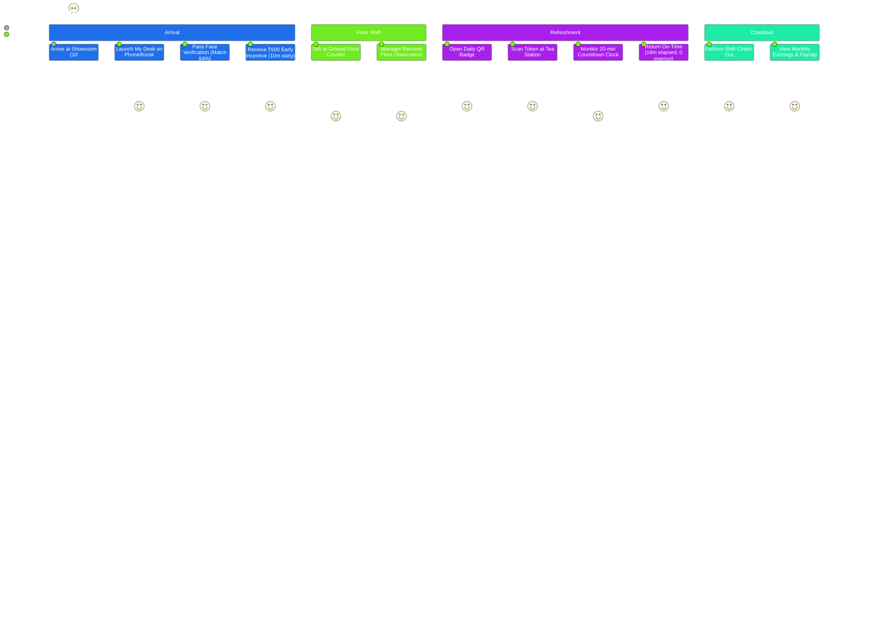
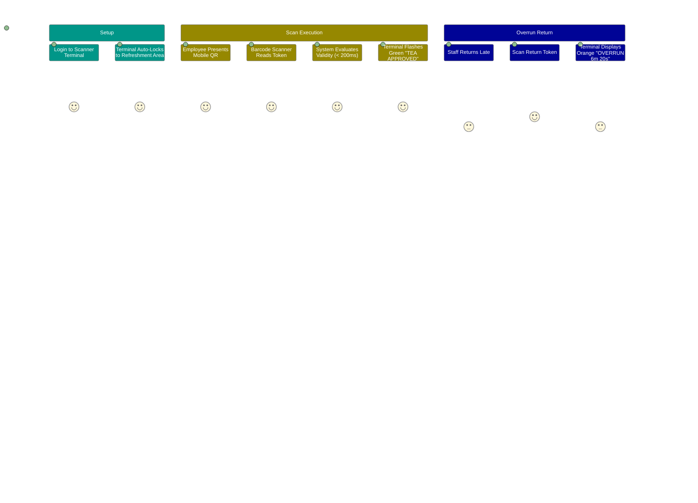

# BSC Textiles HRMS — Master UX Design & Information Architecture

```text
BSC Textiles Pvt Ltd
Weaving Dreams, Building Futures
Document: Master UX Design System & Information Architecture (ux design.md)
Version: 1.0.0 (Production Architecture)
```

---

## 1. Design Philosophy & Aesthetic Foundation

The **BSC Textiles HRMS** user interface is crafted to evoke executive authority, operational clarity, and high responsiveness. Retail environments require interfaces that can be operated quickly under bright store lighting, on mobile floor tablets, or on dedicated scanning kiosks.

### Core Design Pillars
1. **Clarity Over Clutter:** High-density enterprise tables balanced with generous white space and distinct visual hierarchies.
2. **Deterministic Color Semantics:** Colors are never purely decorative; every accent maps directly to a operational status or urgency tier.
3. **Sub-Second Feedback:** Every punch, break initiation, scan verification, or observation update provides immediate optimistic visual confirmation paired with live WebSocket synchronization.
4. **Touch & Tablet Ergonomics:** Interactive scanner buttons, check-in triggers, and QR tokens maintain minimum $48 \times 48\text{px}$ touch targets.

---

## 2. Global Design System Tokens

### Semantic Color Palette

| Token Name | Hex Code | Semantic Role in Interface |
|---|---|---|
| **Primary Navy** | `#173A5E` | Corporate branding, sidebar background, primary headers. |
| **Primary Blue** | `#1F6FEB` | Primary action buttons, active navigation links, focused inputs. |
| **Sky Blue** | `#56CCF2` | Information callouts, active tab indicators, progress highlights. |
| **Success Green**| `#2E9D59` | On-time attendance pills, verified biometrics, approved breaks. |
| **Light Green** | `#DDF4E6` | Success background badges and toast backgrounds. |
| **Warning Orange**| `#F2994A`| Grace period indicators, 5-minute break warnings, pending drafts. |
| **Light Orange**| `#FFF0E1` | Warning card backgrounds. |
| **Danger Red** | `#D64545` | Late penalties, break overruns, biometric match failures. |
| **Light Red** | `#FDE2E2` | Error banner backgrounds and rejected scan alerts. |
| **Purple** | `#7B61FF` | Live stream broadcasts, room chat messages, real-time push alerts. |
| **Light Purple**| `#EEE9FF` | Live stream badges and coaching note highlights. |
| **Teal** | `#009688` | Biometric camera canvases, barcode scanners, hardware status. |
| **Dark Neutral** | `#263238` | Deep card containers, modal headers, code badges. |
| **Surface Gray** | `#F3F4F6` | Global page background, inactive table row striping. |

### Typography Scale
- **Font Family:** `Inter`, system-ui, -apple-system, BlinkMacSystemFont, "Segoe UI", Roboto, sans-serif.
- **Display Headings (`h1`):** `28px` / `36px` line-height, Bold (`700`), Tracking tight.
- **Section Headings (`h2`):** `20px` / `28px` line-height, Semi-Bold (`600`).
- **Card Titles (`h3`):** `16px` / `24px` line-height, Semi-Bold (`600`).
- **Body Text:** `14px` / `20px` line-height, Regular (`400`).
- **Caption & Micro-copy:** `12px` / `16px` line-height, Medium (`500`).
- **Monospace (Formulas & Codes):** `JetBrains Mono`, `Fira Code`, monospace.

---

## 3. Information Architecture (Site Map Tree)

```mermaid
%%{init: {'theme': 'base', 'themeVariables': { 'primaryColor': '#1F6FEB', 'primaryTextColor': '#FFFFFF', 'primaryBorderColor': '#173A5E', 'lineColor': '#6B7280' }}}%%
graph TD
    APP_ROOT["BSC Textiles HRMS Shell"]:::cDark --> AUTH["Authentication Portal (/login)"]:::cBlue
    APP_ROOT --> MAIN_LAYOUT["Authenticated App Shell (Sidebar + Header + Breadcrumb)"]:::cDark

    MAIN_LAYOUT --> SEC_DASH["1. Executive Dashboards"]:::cBlue
    MAIN_LAYOUT --> SEC_MYDESK["2. Staff Self-Service (/my-desk)"]:::cBlue
    MAIN_LAYOUT --> SEC_HR["3. Workforce & HR Central"]:::cGreen
    MAIN_LAYOUT --> SEC_OPS["4. Live Store Operations"]:::cPurple
    MAIN_LAYOUT --> SEC_COMP["5. Compensation & Payroll"]:::cOrange
    MAIN_LAYOUT --> SEC_ORG["6. Organization Masters"]:::cBlue
    MAIN_LAYOUT --> SEC_ADMIN["7. Platform Administration"]:::cDark

    SEC_DASH --> P_OVERVIEW["/dashboard (Branch Occupancy & Key Metrics)"]:::cBlue

    SEC_MYDESK --> P_CHECKIN["Punch In / Out + WebCam Modal"]:::cTeal
    SEC_MYDESK --> P_MYQR["Dynamic Daily QR Badge Modal"]:::cTeal
    SEC_MYDESK --> P_MYBREAK["Sub-Second Break Countdown Widget"]:::cGreen
    SEC_MYDESK --> P_MYPAY["My Payslips & Incentive Breakdown"]:::cOrange

    SEC_HR --> P_EMP["/employees (Personnel Directory & Lifecycle)"]:::cGreen
    SEC_HR --> P_MUSTER["/attendance/muster (Daily Muster Roll)"]:::cGreen
    SEC_HR --> P_SHIFTS["/attendance/shifts (Shift Timetable)"]:::cGreen
    SEC_HR --> P_LEAVES["/leaves (Leave Applications & Review)"]:::cGreen
    SEC_HR --> P_REPORTS["/reports (Exportable BI & Muster Sheets)"]:::cGreen

    SEC_OPS --> P_SCANNER["/operations/scanner (T-Shop Refreshment Terminal)"]:::cTeal
    SEC_OPS --> P_STREAMS["/operations/live-streams (Showroom Camera Feeds)"]:::cPurple
    SEC_OPS --> P_OBS["/operations/observations (Floor Coaching Notes)"]:::cPurple
    SEC_OPS --> P_BREAK_MON["/attendance/breaks (Live Floor Break Monitor)"]:::cGreen

    SEC_COMP --> P_INC["/incentives (Rules Engine & Grants)"]:::cOrange
    SEC_COMP --> P_PEN["/incentives/penalties (Punctuality Deductions)"]:::cOrange
    SEC_COMP --> P_PAYROLL["/payroll (Batch Generator & Salary Slips)"]:::cOrange

    SEC_ORG --> P_LOC["/organization/locations (Store Masters)"]:::cBlue
    SEC_ORG --> P_FLR["/organization/floors (Showroom Levels)"]:::cBlue
    SEC_ORG --> P_DEP["/organization/departments (Men's, Women's, Sarees)"]:::cBlue
    SEC_ORG --> P_SEC["/organization/sections (Display Sections)"]:::cBlue
    SEC_ORG --> P_SP["/organization/selling-points (Registers / POS)"]:::cBlue

    SEC_ADMIN --> P_USERS["/admin/users (System Logins & Passwords)"]:::cDark
    SEC_ADMIN --> P_ROLES["/admin/roles (RBAC Permission Matrix)"]:::cDark
    SEC_ADMIN --> P_AUDIT["/admin/audit (Immutable Audit Ledger)"]:::cDark
    SEC_ADMIN --> P_BACKUP["/admin/backup (Disaster Recovery Dumps)"]:::cDark
    SEC_ADMIN --> P_CONF["/admin/settings (Store Policies & Thresholds)"]:::cDark

    classDef cBlue fill:#1F6FEB,stroke:#173A5E,stroke-width:2px,color:#FFFFFF;
    classDef cGreen fill:#2E9D59,stroke:#1E6B3D,stroke-width:2px,color:#FFFFFF;
    classDef cOrange fill:#F2994A,stroke:#C26D22,stroke-width:2px,color:#FFFFFF;
    classDef cPurple fill:#7B61FF,stroke:#523BC7,stroke-width:2px,color:#FFFFFF;
    classDef cTeal fill:#009688,stroke:#00675B,stroke-width:2px,color:#FFFFFF;
    classDef cDark fill:#263238,stroke:#10171A,stroke-width:2px,color:#FFFFFF;
```



---

## 4. Component Hierarchy & Atomic Design

```mermaid
%%{init: {'theme': 'base', 'themeVariables': { 'primaryColor': '#1F6FEB', 'primaryTextColor': '#FFFFFF', 'primaryBorderColor': '#173A5E', 'lineColor': '#6B7280' }}}%%
flowchart TD
    subgraph ATOMS["1. Atomic UI Elements"]
        BTN["Button (Primary, Secondary, Danger, Ghost)"]:::cBlue
        INP["Input / Select / DatePicker"]:::cBlue
        BADGE["Status Badge (Green, Orange, Red, Gray)"]:::cGreen
        ICON["Lucide React Icons (24px / 20px / 16px)"]:::cBlue
    end

    subgraph MOLECULES["2. Molecular Components"]
        SEARCH["Search & Filter Bar"]:::cBlue
        PAGIN["Pagination Controller"]:::cBlue
        METRIC_CARD["KPI Metric Tile (Stat + Delta + Icon)"]:::cGreen
        COUNTDOWN["Sub-Second Break Countdown Widget"]:::cPurple
    end

    subgraph ORGANISMS["3. Organisms & Composite Blocks"]
        TABLE["Interactive DataTable (Sort, Filter, Export)"]:::cBlue
        CAM_MODAL["Face Verification Canvas Modal"]:::cTeal
        QR_MODAL["Daily QR Token Display Card"]:::cTeal
        STREAM_WIDGET["Live Stream Player + Timecoded Chat"]:::cPurple
        NAV_SIDEBAR["Responsive RBAC-Aware Sidebar Drawer"]:::cDark
    end

    subgraph TEMPLATES["4. Page Templates & Layouts"]
        DASH_LAYOUT["Dashboard Shell (Sidebar + TopNav + Content)"]:::cDark
        FULL_LAYOUT["Terminal Shell (Kiosk / Scanner Mode)"]:::cDark
    end

    ATOMS --> MOLECULES --> ORGANISMS --> TEMPLATES

    classDef cBlue fill:#1F6FEB,stroke:#173A5E,stroke-width:2px,color:#FFFFFF;
    classDef cGreen fill:#2E9D59,stroke:#1E6B3D,stroke-width:2px,color:#FFFFFF;
    classDef cPurple fill:#7B61FF,stroke:#523BC7,stroke-width:2px,color:#FFFFFF;
    classDef cTeal fill:#009688,stroke:#00675B,stroke-width:2px,color:#FFFFFF;
    classDef cDark fill:#263238,stroke:#10171A,stroke-width:2px,color:#FFFFFF;
```



---

## 5. Persona Journey Maps & Interactive States

### 5.1 Sales Employee Journey Map



### 5.2 T-Shop Break Scanner Journey Map



---

## 6. Critical Modal & Micro-Animation Flows

### 6.1 Biometric Face Verification Modal Interaction
1. **Trigger:** User taps "Punch In" on `/my-desk`.
2. **Animation:** Backdrop blur dissolves in (`backdrop-filter: blur(8px)`, duration `200ms`).
3. **Hardware Initialization:** Camera stream binds to `<video>` element with a pulsing circular target reticle.
4. **Capture State:** User clicks "Verify Identity". Frame freezes with a subtle green scanline sweep.
5. **Evaluation Spinner:** Loading indicator with step description: *"Analyzing facial landmarks..."*.
6. **Result Badge:**
   - **Pass ($\ge 85\%$):** Reticle turns vibrant green (`#2E9D59`), displays confidence badge (e.g. `93.4%`), plays soft confirmation ping, and dismisses modal after `800ms`.
   - **Fail ($< 85\%$):** Reticle pulses red (`#D64545`), displays: *"Confidence 74.2% below 85% requirement"*, offers "Retry Capture" button.

### 6.2 Break Countdown Widget Micro-Interactions
- **Healthy Window ($> 5\text{ min}$):** Soft navy background, steady white monospace digits (`18:42`).
- **Warning Window ($\le 5\text{ min}$):** Border transitions to warning orange (`#F2994A`), digits turn amber, gentle pulse every 10 seconds.
- **Overrun Window ($< 0\text{ sec}$):** Background flashes light red (`#FDE2E2`), digits count upwards in bold red (`+03:14 OVERRUN`), toast alert dispatched.

---

## 7. Responsive Breakpoint & Multi-Device Strategy

| Viewport Tier | Breakpoint Width | Layout Adaptations | Primary Use Case |
|---|---|---|---|
| **Mobile Portrait** | $< 640\text{px}$ | Off-canvas drawer menu, stacked metric tiles, full-screen biometric camera, single-column forms. | Employee self-service My Desk on personal smartphones. |
| **Tablet Landscape** | $640\text{px} - 1024\text{px}$ | Persistent compact icon sidebar, 2-column KPI grids, condensed data tables, floating QR scan target. | Floor manager roving tablets and T-Shop scanner stands. |
| **Desktop Full** | $\ge 1024\text{px}$ | Full-width expanded sidebar, 4-column KPI cards, full data tables with sticky column headers, dual-pane live stream + chat. | HR Manager & Super Admin back-office workstations. |

---

## 8. Accessibility & Ergonomics Standards

- **Color Contrast:** All text meets or exceeds WCAG 2.1 Level AA requirements (minimum contrast ratio of $4.5:1$ for body copy, $3:1$ for large headings).
- **Keyboard Navigation:** Modals trap focus; data tables support arrow key navigation; search filters bind to `Cmd+K` / `Ctrl+K`.
- **Screen Reader Support:** Interactive icons include descriptive `aria-label` attributes (e.g., `aria-label="Start Tea Break"`, `aria-label="Export Muster Roll to CSV"`).
