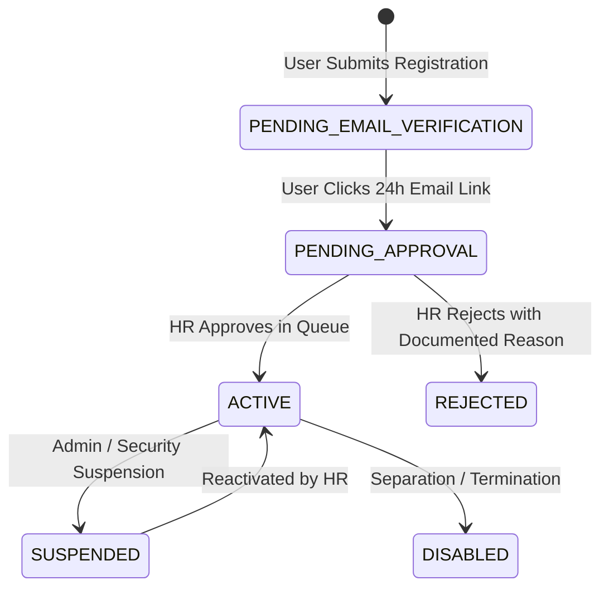

# BSC Textiles HRMS — Enterprise Security Architecture

**Version:** 1.0.0 Production Baseline  
**Classification:** Enterprise Security Architecture Specification  
**Application:** BSC Textiles HRMS (Multi-Store Showroom Core)  

---

## 1. Architectural Principles

### 1.1 Defense in Depth
The BSC Textiles HRMS security architecture implements layered, independent defense controls across every tier of the application stack:

```
┌─────────────────────────────────────────────────────────────┐
│ 1. EDGE & NETWORK LAYER: Nginx Reverse Proxy               │
│    TLS 1.2/1.3, Rate Limiting, Request Buffers, HSTS       │
└──────────────────────────┬──────────────────────────────────┘
                           ▼
┌─────────────────────────────────────────────────────────────┐
│ 2. APPLICATION PERIMETER: Security Headers & Middleware      │
│    Strict CSP, CORS Allowlist, CSRF Double Submit, X-Options│
└──────────────────────────┬──────────────────────────────────┘
                           ▼
┌─────────────────────────────────────────────────────────────┐
│ 3. IDENTITY & ACCESS: Authentication & Session Core         │
│    Argon2id, TOTP MFA, Device Fingerprinting, 30m Idle      │
└──────────────────────────┬──────────────────────────────────┘
                           ▼
┌─────────────────────────────────────────────────────────────┐
│ 4. AUTHORIZATION LAYER: Server-Side RBAC & LBAC             │
│    Location Quarantine (BEL, DAV, SHI), Deny-by-Default     │
└──────────────────────────┬──────────────────────────────────┘
                           ▼
┌─────────────────────────────────────────────────────────────┐
│ 5. DATA & PERSISTENCE: Native MySQL 8.0 Engine              │
│    Parameterized Queries, Foreign Keys, Audit Hash Chains   │
└─────────────────────────────────────────────────────────────┘
```

### 1.2 Zero Trust Authorization
1. **Never Trust Client Context:** User ID, role, and location ID transmitted from the client in headers, parameters, or bodies are never accepted without validation against the cryptographically verified session in MySQL.
2. **Explicit Deny-by-Default:** Any action lacking an explicit matching permission returns HTTP 403: `"You do not have permission to perform this action."`
3. **Session Revocation Immediacy:** Critical security events (password changes, role modifications, admin revocation) immediately publish session invalidation to the `revoked_token` blocklist.

---

## 2. Authentication Architecture

### 2.1 Password Hashing & Migration
- **Primary Algorithm:** Argon2id via `@node-rs/argon2`
  - Memory Cost: 65,536 KB (64 MB)
  - Time Cost (Iterations): 3
  - Parallelism: 4
- **Legacy Migration:** When users with legacy bcrypt hashes log in, the password is verified against bcrypt. Upon successful verification, the password is re-hashed using Argon2id and updated in the database.
- **History Enforcement:** The `password_history` table stores the previous 12 hashes to prevent reuse.
- **Brute-Force Lockout:** Tracked via `login_attempt` and `user.failedLoginAttempts`. Five consecutive failures trigger a progressive 15-minute lockout (`lockedUntil`).

### 2.2 Multi-Factor Authentication (MFA)
- **Standard:** RFC 6238 Time-Based One-Time Passwords (TOTP) via `otplib`.
- **Enrollment:** Returns base32 secret, `otpauth://` URI, and PNG QR code Data URL.
- **Recovery Codes:** Generates 10 cryptographically random, single-use backup codes. The codes are hashed with SHA-256 before storage in `mfa_device.backupCodes`. Upon verification, the matching code is removed from the array to prevent replay.
- **Enforcement Policy:**
  - `SUPER_ADMIN`, `ADMIN`, `HR_MANAGER`, `PAYROLL_MANAGER`: Mandatory.
  - Showroom Employees, Sales, Tea Break Staff: Optional.

### 2.3 Session Management
- **Token Design:** Stateless JWT (HS256) carrying subject (`userId`), issuer (`bsc-textiles-hrms`), session identifier (`sessionId`), and MFA verification status (`mfaVerified`).
- **Session Record:** Stored in `session` table with device fingerprint (`device_fingerprint`), source IP, user agent, risk score, and expiration.
- **Timeouts:**
  - Idle Timeout: 30 minutes of inactivity revokes session.
  - Absolute Timeout: 12 hours forces re-authentication.
  - Concurrent Sessions: Maximum 3 active sessions per user (oldest evicted upon excess).
- **Instant Revocation:** Handled via `revoked_token` table (`jti` match) and `session.revoked = 1`.

---

## 3. Account Lifecycle & HR Approval Workflow

New account creation follows a strict four-state workflow:



### Governance Rules:
- Accounts in `PENDING_EMAIL_VERIFICATION` or `PENDING_APPROVAL` cannot authenticate or access protected modules.
- **Self-Approval Guard:** HR personnel cannot approve their own registration (`targetUserId !== approverUserId`).
- Every approval or rejection persists the approver ID, timestamp, and audit trail.

---

## 4. Multi-Tenant Location Scoping (LBAC)

BSC Textiles operates flagship showrooms across Karnataka:
- Belagavi (`loc_bel` / `BEL`)
- Davanagere (`loc_dav` / `DAV`)
- Shivamogga (`loc_shi` / `SHI`)

### Scoping Rules:
1. `SUPER_ADMIN` and `ADMIN` hold global cross-location visibility.
2. Store Managers and HR Managers are restricted to their assigned showroom.
3. Showroom staff cannot view, edit, or list records from other locations.
4. If a non-elevated user submits a request with an unassigned `locationId` query/body parameter, the backend denies the request with HTTP 403: `"You do not have permission to perform this action."`

---

## 5. File Upload Security & Malware Quarantine

```
Client Upload 
   │
   ▼
[Size & Traversal Check] ──(Fails)──▶ HTTP 400 Path Traversal / Size Exceeded
   │ (Passes)
   ▼
[Extension & Double Extension Check] ──(Fails)──▶ HTTP 400 Extension Denied
   │ (Passes)
   ▼
[Magic Bytes Signature Verification] ──(Fails)──▶ HTTP 400 Signature Mismatch
   │ (Passes)
   ▼
[Malware Scanning (EICAR & Hash Check)] ──(Threat)──▶ Quarantine Vault & Alert
   │ (Clean)
   ▼
[Server-Side Random Filename (UUID)]
   │
   ▼
Permanent Secure Storage (`storage/secure/`)
```

- Uploaded files are assigned random server-generated names (`uuid.ext`) and stored outside the web root.
- Infected files are isolated in `storage/quarantine/` and marked `INFECTED` in `file_upload`.

---

## 6. Tamper-Resistant Audit Trail

The audit system maintains a cryptographic SHA-256 hash chain:

```
Record N-1: [Hash: e3b0c442...]
     │
     ▼
Record N:   hash = SHA256(previousHash="e3b0c442..." + id + userId + action + entityId + ipAddress)
     │
     ▼
Record N+1: hash = SHA256(previousHash=Record_N.hash + ...)
```

- Sensitive fields (`password`, `token`, `secret`, `backupCodes`) are redacted before storage.
- The `AuditService.verifyIntegrity()` function detects unauthorized database alterations, row deletions, or out-of-order records.

---

## 7. Infrastructure Hardening

- **Nginx Reverse Proxy:** Terminating TLS 1.2/1.3, enforcing HSTS (`max-age=31536000`), stripping `X-Powered-By`, and rate limiting requests.
- **Docker Network Segmentation:** MySQL is placed on an internal `backend-network` with no exposed host ports, accessible only by the backend container.
